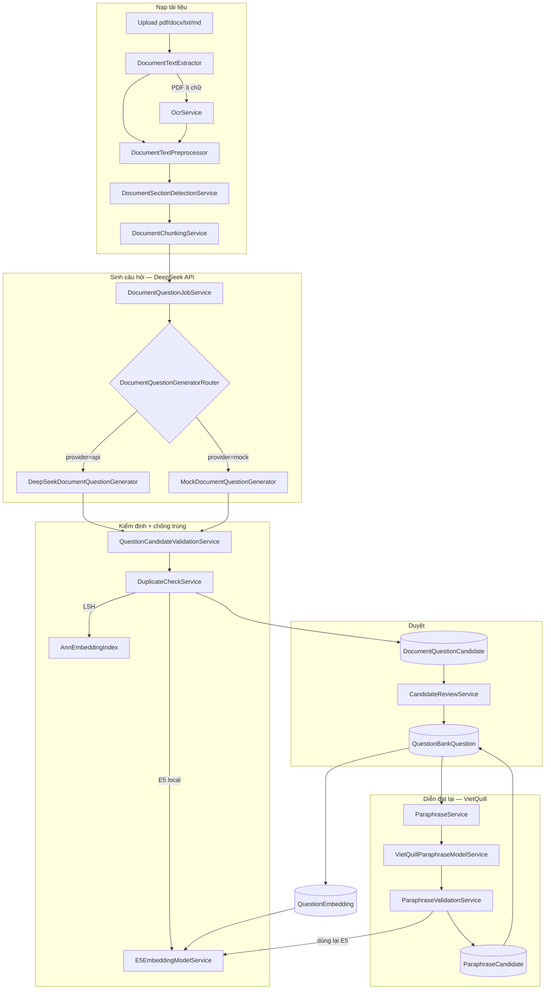
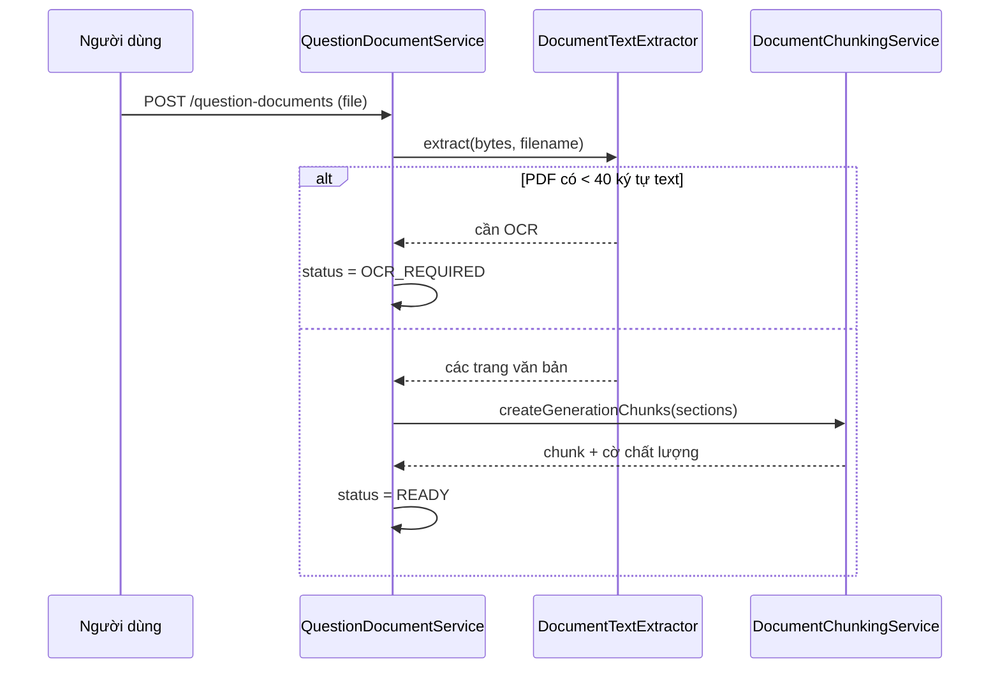
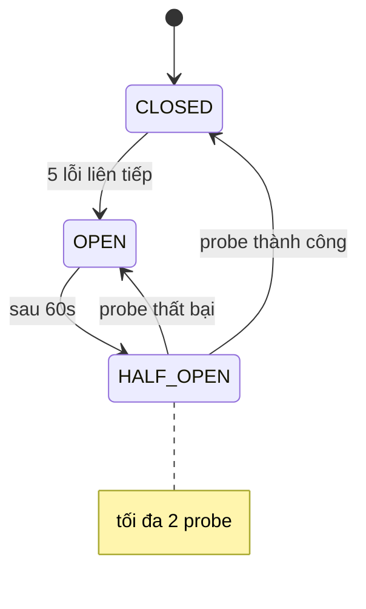
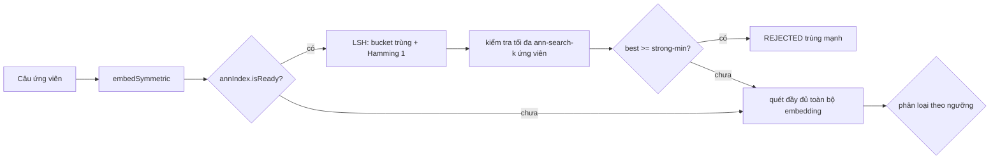

# Tài liệu mô hình AI trong CareHub

Phạm vi: ba luồng AI trong package `vn.vietduc.carehubbackend.questiongeneration` — sinh câu hỏi
bằng DeepSeek API, nhúng vector chống trùng bằng E5 (ONNX local), và diễn đạt lại câu hỏi bằng
VietQuill (ONNX local).

Tài liệu này trả lời ba câu hỏi: **luồng chạy thế nào**, **mỗi tham số có khoảng giá trị nào và
ảnh hưởng ra sao**, và **cấu hình nào là tối ưu** (kèm cách tự đo lại trên máy của bạn).

Mọi con số đo được nằm ở [§8](#8-số-đo-thực-tế) và sinh ra từ bộ benchmark trong
`src/test/java/.../modelruntime/` — xem [§7](#7-cách-chạy-benchmark) để chạy lại.

---

## 1. Bản đồ tổng thể



Ba model, ba chế độ vận hành khác hẳn nhau:

| | DeepSeek | E5 | VietQuill |
|---|---|---|---|
| Vị trí chạy | API ngoài | trong JVM (ONNX Runtime) | trong JVM (ONNX Runtime) |
| Kích thước | — | 449 MB | ~2,1 GB mỗi handle |
| Chi phí | tính theo token | CPU | CPU |
| Điểm nghẽn | độ trễ mạng + rate limit | CPU, tuyến tính theo số câu | CPU, **bậc hai** theo độ dài sinh ra |
| Hỏng thì sao | circuit breaker → job FAILED | rơi về so khớp từ khoá | job paraphrase FAILED |
| Bật/tắt | `ai.generation.provider` | `ai.embedding.provider` | `ai.paraphrase.provider` |

---

## 2. Luồng 1 — Sinh câu hỏi từ tài liệu

### 2.1 Nạp và chia chunk



**Hai cảnh báo về tham số chunk — cả hai đều gây hiểu nhầm nghiêm trọng:**

1. **Đơn vị không phải "token".** `DocumentChunkingService.estimateTokens()` là
   `text.trim().split("\\s+").length` — **đếm từ theo khoảng trắng**. Với tiếng Việt, tokenizer
   subword sinh khoảng 1,5–2,5 token cho mỗi từ.

2. **`target-tokens` KHÔNG hề cắt chunk.** Cả ba chỗ cắt trong `chunkSection()` và
   `splitLongParagraph()` đều so với `getMaxTokens()` (dòng 41, 52, 79); `getTargetTokens()`
   chỉ xuất hiện đúng một lần ở dòng 112 để gắn cờ `ABOVE_TARGET_TOKEN_RANGE` — mà cờ này
   **không chặn** sinh câu hỏi.

Gộp lại: kích thước chunk thật do `max-tokens = 1200 **từ**` quyết định, tức khoảng
**1 800–3 000 token** khi gửi cho DeepSeek — chứ không phải 750 như tên tham số gợi ý.
Chỉnh `target-tokens` không làm chunk nhỏ đi; phải chỉnh `max-tokens`.

Cờ chất lượng chunk (`DocumentChunkQualityRules`) — bốn cờ đầu **chặn** sinh câu hỏi:

| Cờ | Điều kiện | Chặn? |
|---|---|:---:|
| `LOW_INFORMATION_DENSITY` | `text.length() < chunk.min-useful-text-length` (80 ký tự) | ✔ |
| `HEADING_ONLY` | chunk chỉ là tiêu đề | ✔ |
| `DUPLICATE_TEXT` | trùng nội dung đã chuẩn hoá với chunk trước | ✔ |
| `TABLE_LIKE_LOW_CONFIDENCE` | giống bảng + độ tin mục thấp | ✔ |
| `ABOVE_TARGET_TOKEN_RANGE` | `tokenCount > chunk.target-tokens` | ✘ |
| `LOW_SECTION_CONFIDENCE` | `section.confidence() < 0.5` | ✘ |

Nếu **mọi** chunk đều bị chặn, `createJob` ném lỗi "Tài liệu không có chunk đủ điều kiện".

**OCR mặc định TẮT.** `NoOpOcrService` có `@ConditionalOnProperty(name = "app.ocr.engine",
havingValue = "none", matchIfMissing = true)` và khoá `app.ocr.engine` **không có trong
`application.yaml`** → NoOp luôn thắng. Tài liệu scan sẽ kẹt vĩnh viễn ở `OCR_REQUIRED`.
Muốn bật: cài `tesseract` vào PATH rồi đặt `app.ocr.engine=tesseract`.

### 2.2 Chạy job

Job chạy bất đồng bộ, tách khỏi request HTTP:

```
createJob (@Transactional)
  └─ publish DocumentQuestionJobCreatedEvent
       └─ DocumentQuestionJobWorker  @Async("documentQuestionJobExecutor")
                                     @TransactionalEventListener(AFTER_COMMIT)
            └─ processJob  ── prepareJobForProcessing   (@Transactional, ngắn)
                           ├─ processChunks             (KHÔNG transaction — gọi N lần LLM)
                           │    └─ mỗi chunk: processSingleChunkTransactional (REQUIRES_NEW)
                           └─ applyResultTransactional  (@Transactional, ngắn)
```

Chuỗi trạng thái: `CREATED → GENERATING → GENERATED | PARTIALLY_COMPLETED | FAILED | CANCELLED`.

Hai pool riêng biệt:
- `documentQuestionJobExecutor` — 2 core / 4 max / hàng đợi 50: chạy **cả phiên**.
- `documentChunkExecutor` — `max-concurrent-calls` thread, hàng đợi 200, `CallerRunsPolicy`:
  chạy **từng chunk** trong một phiên.

Tăng số thread chunk vượt `max-concurrent-calls` không có tác dụng vì semaphore trong generator
mới là thứ chặn số lời gọi API đồng thời.

### 2.3 Idempotency

Mỗi ứng viên có `generationKey` = hash của
`(provider, model, promptVersion, questionsPerChunk, chunk.textHash, "vi", categoryId, chỉ số câu)`.
Nếu đã tồn tại ứng viên với khoá đó ở trạng thái VALIDATED/NEED_REVIEW/APPROVED/REJECTED/SAVED
thì chunk được bỏ qua, không gọi lại API. Vì vậy **chạy lại cùng một tài liệu với cùng cấu hình
sẽ không tốn thêm tiền** — nhưng cũng không sinh câu mới. Muốn sinh lại phải đổi `prompt-version`
hoặc `questionsPerChunk`.

### 2.4 Chống lỗi khi gọi DeepSeek



Retry thích ứng theo loại lỗi:

| Loại lỗi | HTTP | Số retry | Backoff |
|---|---|---|---|
| `AUTHENTICATION` | 401, 403 | **0** — không retry | — |
| `RATE_LIMIT` | 429 | 3 | 4s → 8s → 16s |
| `SERVER_ERROR` | 500/502/503/504 | `max-retries` | 500ms × 2ⁿ |
| `TIMEOUT` | — | `max-retries` | 200ms × 2ⁿ |
| `PARSE_ERROR` | JSON hỏng | 1 | 200ms × 2ⁿ |
| `UNKNOWN` | khác | `max-retries` | 200ms × 2ⁿ |

Trong lúc backoff, permit của semaphore được **nhả ra** để chunk khác dùng, rồi lấy lại sau.

### 2.5 Hai điểm khiến câu hỏi biến mất mà không báo lỗi

Cả hai đều có log, nhưng job vẫn báo thành công với `candidateCount` thấp hơn mong đợi.

1. **Silent drop theo knowledge point.** Trong `parseSingleCallResult`, nếu không có knowledge
   point nào `generationEligible=true` thì **toàn bộ** câu hỏi của chunk bị bỏ, kể cả khi model
   đã sinh câu hợp lệ. Tìm log `Silent drop: all knowledge points ineligible`.

2. **Bộ lọc stem chung chung.** `isGenericDocumentReferenceStem` loại câu mở đầu bằng
   "theo tài liệu", "dựa vào tài liệu", "trong tài liệu", "theo nội dung", hoặc chứa
   "phù hợp (nhất) với nội dung trong mục". Tìm log `Question dropped by stem filter`.
   *Lưu ý kỹ thuật:* chuỗi so sánh chỉ hạ chữ thường và gom khoảng trắng, **không bỏ dấu** —
   nên các biến thể không dấu trong danh sách (`theo tai lieu`, ...) thực tế không bao giờ khớp.

---

## 3. Luồng 2 — Nhúng và chống trùng (E5)

### 3.1 Model

`intfloat/multilingual-e5-small`, 384 chiều, ONNX 449 MB. Thư mục model chỉ cần
`onnx/model.onnx` + `onnx/tokenizer.json` (không cần `config.json`).

Xử lý: tokenize → ONNX forward → **mean-pool có mask** → **L2-normalize**.
Vì vector đã chuẩn hoá, `CosineUtil.cosine` chỉ là tích vô hướng (và bị kẹp về ≥ 0).

Input của graph: `input_ids`, `attention_mask`, `token_type_ids`; output `last_hidden_state`.

> **Ghi chú về pad token.** `embedBatch` khởi tạo mảng padding bằng `new long[size][maxSeqLen]`,
> tức pad bằng id **0**. Nhưng tokenizer XLM-R của model này có id 0 = `<s>` còn `<pad>` = **1**.
> Trên thực tế điều này **vô hại** vì `attention_mask` tại các vị trí đó bằng 0 nên chúng vừa
> không được token khác chú ý tới, vừa bị loại khỏi mean-pool. Đã kiểm chứng bằng đo đạc:
> vector theo lô và vector từng câu trùng khít (`cosine = 1,000000`, lệch phần tử `0,000e+00`).
> Vẫn nên sửa thành pad id 1 để không phụ thuộc vào việc masking luôn đúng.

### 3.2 Tiền tố đối xứng — điểm dễ sai nhất

E5 được huấn luyện với hai tiền tố: `query: ` và `passage: `. Cặp này dành cho **truy hồi bất đối
xứng** (câu hỏi ngắn đi tìm đoạn văn dài). So trùng hai câu hỏi với nhau là bài toán **đối xứng**,
và với bài toán đối xứng thì **cả hai vế phải dùng cùng một tiền tố**.

Trước đây hệ thống nhúng ngân hàng bằng `passage: ` còn ứng viên bằng `query: `. Trộn hai tiền tố
đẩy hai vector về hai vùng khác nhau của không gian nhúng → điểm cosine bị kéo xuống một cách hệ
thống → câu trùng thật lọt qua ngưỡng 0,93.

Hiện tại dùng `E5TextPreprocessor.symmetric()` (= `query: `) cho cả hai vế, qua
`EmbeddingModelService.embedSymmetric()`. Mức dịch điểm đo được ở [§8.2](#82-hiệu-chỉnh-ngưỡng-trùng-lặp).

> **Khi nào vẫn dùng bất đối xứng?** Nếu sau này có tính năng "tìm đoạn tài liệu liên quan tới
> câu hỏi", đó mới là truy hồi bất đối xứng và phải dùng `embedQuery` cho câu hỏi +
> `embedPassage` cho đoạn văn. Hai hàm đó vẫn được giữ nguyên cho mục đích này.

### 3.3 Phiên bản hoá embedding

`QuestionEmbedding.textType` mang phiên bản cách nhúng, hiện là `stem_sym_v2`
(trước là `stem`). Cột này nằm trong unique constraint và trong mọi truy vấn tra cứu, nên đổi giá
trị = vô hiệu hoá toàn bộ embedding cũ → backfill tự sinh lại.

Đổi bất cứ thứ gì làm thay đổi ngữ nghĩa vector (tiền tố, model, cách pooling) → **phải tăng
phiên bản này**, nếu không vector cũ và mới sẽ lẫn lộn trong cùng một index.

Dọn bản ghi cũ: `POST /api/v1/question-embeddings/backfill?dropLegacy=true` (mặc định `false`
để rollback code được mà không mất dữ liệu).

### 3.4 Cache và ANN



- **Cache**: Caffeine, đúng một khoá `approved_stems`, TTL `ai.embedding.cache-ttl-minutes`.
  `invalidate()` tăng một bộ đếm phiên bản.
- **ANN**: LSH random projection, **seed cố định 42** nên kết quả tái lập được.
  Index chỉ build lại khi phiên bản dữ liệu đổi — so theo số lượng phần tử là **không đủ**
  (sửa nội dung một câu làm vector đổi nhưng số lượng giữ nguyên).
- **Dừng sớm phải dùng `strong-min`, không phải `review-min`.** ANN dừng ngay khi chạm ngưỡng
  truyền vào; nếu truyền `review-min` (0,80) thì nó trả về match **đầu tiên** vượt 0,80 chứ không
  phải match **tốt nhất** → câu trùng 0,95 bị hạ cấp thành "cần xem lại".

### 3.5 Thứ tự thử và nhãn `checker`

| Nhãn | Nghĩa |
|---|---|
| `e5-ann` | ANN tìm ra và đủ chắc chắn |
| `e5-exact` | ANN không đủ chắc → đã quét đầy đủ |
| `e5` | ANN chưa sẵn sàng → quét đầy đủ ngay từ đầu |
| `lexical-candidate` | trùng với ứng viên khác trong cùng đợt (Jaccard) |
| `lexical-fallback` | E5 lỗi hoặc ngân hàng chưa có embedding → so khớp từ khoá |

> **Bẫy cần biết:** đường `lexical-*` dùng **Jaccard trên tập từ đã bỏ dấu**, thang điểm khác hẳn
> cosine, nhưng lại so với **cùng** hai ngưỡng `strong-min`/`review-min`. Ngưỡng hiệu chỉnh cho
> cosine không tự động đúng cho Jaccard. Nếu hệ thống đang chạy ở chế độ fallback (chưa backfill
> xong, hoặc `provider=lexical`), hãy coi kết quả chống trùng là chỉ báo thô.

---

## 4. Luồng 3 — Diễn đạt lại (VietQuill)

### 4.1 Model và input

`ngwgsang/vietquill-vit5-base-tsubaki` — T5 (`T5ForConditionalGeneration`):

| Thông số | Giá trị |
|---|---|
| `vocab_size` | 36 153 |
| `d_model` | 768 |
| `num_layers` / `num_decoder_layers` | 12 / 12 |
| `num_heads` × `d_kv` | 12 × 64 |
| `decoder_start_token_id` / `eos` / `pad` | 0 / 1 / 0 |

Hai model tách rời — `question/` (diễn đạt lại câu hỏi) và `sentence/` (diễn đạt lại câu trần
thuật, dùng cho các phương án). Mỗi model có encoder 431 MB + decoder 645 MB →
**~2,1 GB cho một handle**, và `pool-size=2` → **~4,3 GB bộ nhớ native**. Đây là ràng buộc bộ nhớ
lớn nhất của cả hệ thống; đặt `-Xmx` không kiểm soát được phần này vì nó nằm ngoài heap JVM.

**Input không phải ngôn ngữ tự nhiên.** `VietQuillPromptBuilder` sinh đúng dạng
`SEM_x SYN_y LEX_z : <văn bản>`. Thêm chỉ dẫn tiếng Việt vào input sẽ gây rò rỉ prompt ra output
(và `ParaphraseValidationService` sẽ loại vì phát hiện `SEM_`/`SYN_`/`LEX_`).

| `changeStrength` | SEM | SYN | LEX | Ý nghĩa |
|---|---|---|---|---|
| `low` / `nhẹ` | 95 | 90 | 80 | giữ nghĩa tối đa, đổi ít |
| *(mặc định)* / `medium` | 90 | 75 | 50 | cân bằng |
| `high` / `mạnh` | 90 | 60 | 40 | đổi cấu trúc và từ vựng nhiều |

### 4.2 Ứng viên đến từ hai nguồn

```
ứng viên = VietQuillStructuralRewriter.rewrite(source)   ← regex, KHÔNG cần model
         + các beam từ beamDecode(...)                    ← cần model
         → distinct → VietQuillCandidateSelector.select(...)
```

`VietQuillStructuralRewriter` viết lại ba dạng câu tiếng Việt phổ biến bằng regex
(đảo mệnh đề "Khi/Trước khi/Sau khi/Nếu...", "… cần làm gì để …", "Mục đích của … là gì").
Đây là nguồn ứng viên **miễn phí** — nếu câu gốc khớp một trong ba mẫu, bạn có biến thể tốt mà
không tốn một bước decode nào.

### 4.3 Beam width thực tế lớn hơn cấu hình

```java
int candidatePoolSize = Math.max(requestedCount * 2, requestedCount + 3);
int desiredBeamWidth  = Math.max(properties.getNumBeams(), candidatePoolSize);
// trần cứng: Math.min(12, desiredBeamWidth)
```

Với `num-beams=2` (giá trị trong `application.yaml`) và `requested-count-default=3`:

```
candidatePoolSize = max(3×2, 3+3) = 6
desiredBeamWidth  = max(2, 6)     = 6      ← gấp 3 lần cấu hình
```

**Hệ quả thực tế: giảm `num-beams` xuống 1 hay 2 không làm nhanh hơn chút nào.** Muốn giảm chi phí
decode phải giảm `requestedCount` (số biến thể yêu cầu). Bảng quy đổi:

| `requestedCount` | beam width thật (khi `num-beams` ≤ giá trị này) |
|---|---|
| 1 | 4 |
| 2 | 5 |
| 3 *(mặc định)* | 6 |
| 5 | 10 |
| ≥ 6 | 12 *(chạm trần)* |

### 4.4 Vì sao KV-cache đang tắt

`ai.paraphrase.kv-cache-enabled` mặc định `false`, và với model đang dùng thì **bật lên cũng
không có tác dụng gì**.

**Lý do thứ nhất, quyết định: model đã export không hỗ trợ KV-cache.** Kiểm tra trực tiếp
`decoder_model.onnx` cho thấy graph **không có** input `past_key_values` nào và **không có**
output `present` nào:

```
$ python -c "…đếm chuỗi trong protobuf của decoder_model.onnx…"
   past_key_values     = 0
   present             = 0
   input_ids           = 4
   encoder_hidden_states = 23
   encoder_attention_mask = 2      (attention_mask độc lập = 0)
```

`Seq2SeqHandle.kvCacheSupported()` trả về `false` khi không phát hiện được các tên đó, nên nhánh
`beamDecodeWithKvCache` **là code chết** với model hiện tại. Muốn dùng phải export lại thành
`decoder_model_merged.onnx` (bản có `past_key_values`).

**Lý do thứ hai, nếu sau này export lại:** cách cài đặt hiện tại vẫn chưa dùng được vì
`beamDecodeWithKvCache` deep-copy **toàn bộ** cache cho **mỗi** ứng viên beam (`clonePastKV`).
Với 12 lớp × (self k,v + cross k,v) = 48 tensor và beam width thật 6 → tới 36 bản sao đầy đủ mỗi
bước; ở `seqLen=160` mỗi bản sao ≈ 22 MB. Trước khi bật, phải sửa hai chỗ: chỉ sao chép
self-attention KV (cross-attention KV là hằng số theo prompt), và tránh sao chép cho beam bị
loại ngay sau đó.

Nếu bật cờ mà decoder không hỗ trợ, service ghi log cảnh báo và tự dùng đường decode thường —
không hỏng, chỉ là cờ vô nghĩa.

> **Ghi chú về mask:** `decodeLogits()` gọi `addLongTensorIfExpected` cho **cả** `attention_mask`
> lẫn `encoder_attention_mask` với cùng một mảng mask của encoder. Thoạt nhìn có vẻ sai, nhưng
> decoder này **không có** input tên `attention_mask` (chỉ có `encoder_attention_mask`), và
> `addLongTensorIfExpected` kiểm tra `session.getInputNames().contains(name)` trước khi thêm —
> nên lời gọi thừa đó là no-op. Không phải lỗi.

**Chi phí của đường không cache:** mỗi bước decode chạy lại decoder trên **toàn bộ** prefix →
tổng công việc tỉ lệ **bậc hai** với độ dài sinh ra. Đây là lý do `max-decode-length` là tham số
có ảnh hưởng lớn nhất tới thời gian chạy (xem [§8.3](#83-benchmark-vietquill)).

---

## 5. Toàn bộ ngưỡng quyết định

Đây là các con số quyết định câu hỏi được chấp nhận hay bị loại. Ba nhóm dưới đây **độc lập
nhau về cấu hình nhưng phụ thuộc nhau về hành vi** — xem [§5.4](#54-tương-tác-giữa-các-nhóm-ngưỡng).

### 5.1 Chất lượng câu hỏi — `validation.quality.*`

Điểm khởi đầu 0,86.

| Điều kiện | Hệ quả |
|---|---|
| thiếu stem, thiếu phương án, `correctAnswer` ∉ {A,B,C,D} | **REJECTED** |
| hai phương án trùng nội dung (đã bỏ dấu, bỏ ký tự đặc biệt) | **REJECTED** |
| phương án chứa "tất cả đều đúng" / "cả A và B" / "không có đáp án nào" | **REJECTED** |
| thiếu `sourceExcerpt` | **REJECTED** |
| `sourceExcerpt` không khớp chunk gốc | −0,12 điểm |
| điểm < `reject-min` (0,55) | **REJECTED** |
| không bị loại nhưng có cảnh báo | NEED_REVIEW |

Khi bật `ai.generation.llm-validation-enabled`, kết quả từ LLM **ghi đè** `qualityScore`, và ba cờ
`answerable` / `singleBestAnswer` / `correctAnswerSupported` — mỗi cờ `false` → REJECTED.

### 5.2 Trùng lặp — `validation.duplicate.*`

| Khoá | Mặc định | Khoảng hợp lý | Hệ quả khi vượt |
|---|---|---|---|
| `strong-min` | 0,93 | 0,88 – 0,97 | **REJECTED** — "trùng ngữ nghĩa mạnh" |
| `review-min` | 0,80 | 0,70 – `strong-min` | NEED_REVIEW — "có khả năng trùng" |

Đặt quá thấp → loại nhầm câu hỏi tốt cùng chủ đề. Đặt quá cao → để lọt câu trùng vào ngân hàng.
Cách chọn dựa trên dữ liệu: [§8.2](#82-hiệu-chỉnh-ngưỡng-trùng-lặp).

### 5.3 Kiểm định biến thể paraphrase — **hằng số cứng trong code**

Nằm trong `ParaphraseValidationService`, **không cấu hình được qua yaml**:

| Hằng số | Giá trị | Hệ quả |
|---|---|---|
| `LOW_SOURCE_SEMANTIC_SIMILARITY` | 0,72 | cosine(gốc, biến thể) < 0,72 → **REJECTED** "đổi nghĩa" |
| `REVIEW_SOURCE_SEMANTIC_SIMILARITY` | 0,85 | < 0,85 → cảnh báo |
| `LOW_OPTION_SEMANTIC_SIMILARITY` | 0,72 | áp cho từng phương án bị đổi |
| `LOW_LEXICAL_DIFFERENCE` | 0,08 | khác biệt từ vựng < 8% → cảnh báo "quá giống câu gốc" |

Biến thể còn bị **REJECTED** nếu:
- **rò rỉ prompt**: chứa `SEM_`, `SYN_`, `LEX_`, "biến thể số", "mức độ thay đổi", "yêu cầu:", "paraphrase:";
- **mất thuật ngữ được bảo vệ** (`ProtectedTermService`): số kèm đơn vị (`5 mg`, `95 %`, `2 l/phút`),
  khoảng số (`10-15`), viết tắt y khoa (SpO2, ECG, CPR, ABCDE, BMI, HA, M, NT, IV, IM, SC, PPE,
  SARS-CoV-2), token IN HOA ≥ 2 ký tự;
- **đổi dấu hiệu logic**: không / chưa / ngoại trừ / ít nhất / tối thiểu / nhiều nhất / tối đa /
  duy nhất / chỉ một / luôn luôn / không bao giờ. Nhóm nào có ở câu gốc thì phải có ở biến thể và
  ngược lại — đây là chốt chặn quan trọng nhất vì mất một chữ "không" là đảo ngược đáp án đúng.

Bộ lọc đa dạng của `VietQuillCandidateSelector` (chạy **trước** validation):

| `changeStrength` | `minimumChange` | `preferredChange` | `minimumCoverage` |
|---|---|---|---|
| `low` / `nhẹ` | 0,08 | 0,18 | 0,65 |
| medium *(mặc định)* | 0,22 | 0,32 | 0,58 |
| `high` / `mạnh` | 0,22 | 0,42 | 0,60 |

- `changeRatio` = max(1 − Jaccard, 1 − tỉ lệ LCS) trên token đã bỏ dấu;
- `contentCoverage` = tỉ lệ từ nội dung của câu gốc còn giữ (đã bỏ 30 stop word);
- điểm xếp hạng = `|change − preferredChange| + max(0, 0,80 − coverage) × 0,35` (nhỏ hơn = tốt hơn);
- loại trùng gần: Jaccard ≥ 0,88 **và** LCS ≥ 0,82;
- "người bệnh" và "bệnh nhân" được gộp thành cùng một token.

### 5.4 Tương tác giữa các nhóm ngưỡng

Ba nhóm trên dùng **chung một thang điểm cosine từ cùng một model E5**. Vì vậy bất kỳ thay đổi
nào làm dịch phân bố điểm — đổi tiền tố, đổi model, đổi cách pooling — đều tác động lên **cả ba**,
và theo hai chiều **ngược nhau**:

```
điểm cosine dịch LÊN
   ├─ ngưỡng giữ nghĩa 0,72 / 0,85  → ÍT biến thể bị loại vì "đổi nghĩa"   → dễ dãi hơn
   └─ ngưỡng trùng lặp 0,93         → NHIỀU biến thể bị loại vì "trùng"     → khắt khe hơn
```

Nói cách khác, biến thể paraphrase bị **kẹp hai đầu**: phải đủ giống câu gốc để không bị coi là
đổi nghĩa, nhưng đủ khác để không bị coi là trùng. Việc chuyển sang nhúng đối xứng thu hẹp
khoảng đó. Khi hiệu chỉnh lại, **phải chỉnh cả hai bộ**, không chỉ 0,93/0,80.

---

## 6. Bảng tham số đầy đủ

### 6.1 `ai.generation.*` — DeepSeek

| Khoá | Biến môi trường | Mặc định | Khoảng | Ảnh hưởng |
|---|---|---|---|---|
| `provider` | `GENERATION_PROVIDER` | `api` | `api` \| `mock` | `mock` để phát triển không tốn tiền |
| `api-base-url` | `GENERATION_API_BASE_URL` | `https://api.deepseek.com` | URL | |
| `api-key` | `GENERATION_API_KEY` / `DEEPSEEK_API_KEY` | — | | thiếu → ném lỗi ngay |
| `model` | `GENERATION_MODEL` | `deepseek-v4-flash` | | |
| `fallback-model` | `GENERATION_FALLBACK_MODEL` | `deepseek-v4-pro` | | dùng khi model chính lỗi; **giá gấp ~4 lần** |
| `prompt-version` | `GENERATION_PROMPT_VERSION` | `docgen-mvp-flash-v2` | | nằm trong khoá idempotency — đổi = sinh lại |
| `pipeline-mode` | `GENERATION_PIPELINE_MODE` | `single_call` | `single_call` \| `multi_stage` | `multi_stage` = 2 lời gọi/chunk, tách trích kiến thức và sinh câu |
| `timeout-seconds` | `GENERATION_TIMEOUT_SECONDS` | 60 | 30 – 180 | read timeout |
| `connect-timeout-seconds` | `GENERATION_CONNECT_TIMEOUT_SECONDS` | 10 | 5 – 30 | |
| `max-connections` | `GENERATION_MAX_CONNECTIONS` | 10 | ≥ `max-concurrent-calls` | kích thước executor của `HttpClient` |
| `max-retries` | `GENERATION_MAX_RETRIES` | 1 | 0 – 3 | áp cho SERVER_ERROR/TIMEOUT/UNKNOWN |
| `max-concurrent-calls` | `GENERATION_MAX_CONCURRENT_CALLS` | 2 | 1 – 8 | semaphore **và** số thread `documentChunkExecutor` |
| `circuit-breaker-failure-threshold` | — | 5 | 3 – 10 | |
| `circuit-breaker-cooldown-seconds` | — | 60 | 30 – 300 | |
| `temperature` | `GENERATION_TEMPERATURE` | 0,7 | 0 – 1,5 | cao = đa dạng hơn, bám nguồn kém hơn |
| `top-p` | `GENERATION_TOP_P` | 0,9 | 0,1 – 1,0 | |
| `max-output-tokens` | `GENERATION_MAX_OUTPUT_TOKENS` | 1800 | ≥ 800 | quá thấp → JSON bị cắt → PARSE_ERROR |
| `llm-validation-enabled` | `GENERATION_LLM_VALIDATION_ENABLED` | `false` | | **KHÔNG có tác dụng ở `pipeline-mode=single_call`** (chế độ đang chạy) — cờ chỉ được đọc trong `generateMultiStageWithModel`. Ở `multi_stage`, bật = thêm 1 lời gọi API cho MỖI câu hỏi, tuần tự |
| `parallel-chunk-processing` | `GENERATION_PARALLEL_CHUNKS` | `true` | | |
| `chunk-parallelism` | `GENERATION_CHUNK_PARALLELISM` | −1 | −1 hoặc ≥1 | −1 → dùng `max-concurrent-calls` |
| `input-price-per-million` | `GENERATION_INPUT_PRICE` | 0,14 | USD | chỉ dùng để ước tính chi phí |
| `output-price-per-million` | `GENERATION_OUTPUT_PRICE` | 0,56 | USD | |
| `fallback-input-price-per-million` | `GENERATION_FALLBACK_INPUT_PRICE` | 0,55 | USD | |
| `fallback-output-price-per-million` | `GENERATION_FALLBACK_OUTPUT_PRICE` | 2,20 | USD | |

> `llm-validation-enabled` mặc định là `false` trong `application.yaml` nhưng `true` trong
> `AiGenerationProperties.java`. Giá trị lúc chạy là `false`.

### 6.2 `ai.embedding.*` — E5

| Khoá | Biến môi trường | Mặc định | Khoảng | Ảnh hưởng |
|---|---|---|---|---|
| `provider` | `EMBEDDING_PROVIDER` | `e5` | `e5` \| `lexical` | `lexical` = tắt hẳn model, dùng Jaccard |
| `model` | `EMBEDDING_MODEL` | `intfloat/multilingual-e5-small` | | ghi vào `embedding_model`, đổi = vô hiệu embedding cũ |
| `dimension` | `EMBEDDING_DIMENSION` | 384 | | chỉ để hiển thị; chiều thật lấy từ output model |
| `model-path` | `E5_MODEL_PATH` | `models/intfloat/multilingual-e5-small` | | |
| `preload` | `E5_PRELOAD` | `true` | | `true` = nạp lúc khởi động (chậm khởi động, nhanh request đầu) |
| `backfill-on-startup` | `E5_BACKFILL_ON_STARTUP` | `true` | | |
| `backfill-async` | `E5_BACKFILL_ASYNC` | `true` | | `false` sẽ chặn `ApplicationReadyEvent` |
| `max-length` | `E5_MAX_LENGTH` | 512 | 128 – 512 | token vượt bị **cắt cụt**; stem câu hỏi hiếm khi chạm |
| `batch-size` | `E5_BATCH_SIZE` | 32 | 1 – 128 | xem [§8.1](#81-benchmark-e5) |
| `batch-enabled` | `E5_BATCH_ENABLED` | `true` | | `false` = nhúng từng câu khi backfill |
| `intra-op-threads` | `E5_INTRA_OP_THREADS` | −1 | −1 hoặc ≥1 | −1 → `availableProcessors()−1` |
| `inter-op-threads` | `E5_INTER_OP_THREADS` | 1 | 1 – 4 | |
| `cache-ttl-minutes` | `E5_CACHE_TTL_MINUTES` | 30 | 5 – 240 | |
| `cache-warmup-enabled` | `E5_CACHE_WARMUP_ENABLED` | `true` | | |
| `ann-enabled` | `E5_ANN_ENABLED` | `true` | | `false` = luôn quét đầy đủ (chính xác nhất, chậm nhất) |
| `ann-lsh-bits` | `E5_ANN_LSH_BITS` | 16 | 8 – 24 | nhiều bit = bucket nhỏ hơn, nhanh hơn, recall thấp hơn |
| `ann-search-k` | `E5_ANN_SEARCH_K` | 50 | 10 – 200 | trần số ứng viên kiểm tra chính xác |
| `ann-neighbor-buckets` | `E5_ANN_NEIGHBOR_BUCKETS` | `true` | | quét thêm bucket cách Hamming 1 → recall cao hơn, chậm hơn |
| `dedup-page-size` | `E5_DEDUP_PAGE_SIZE` | 500 | | kích thước trang khi nạp embedding và khi backfill theo lô |
| `lexical-page-size` | `E5_LEXICAL_PAGE_SIZE` | 500 | | dùng cho đường fallback |
| `timeout-seconds` | `E5_TIMEOUT_SECONDS` | 30 | | |
| `fallback-provider` | `E5_FALLBACK_PROVIDER` | `lexical` | | |

### 6.3 `ai.paraphrase.*` — VietQuill

| Khoá | Biến môi trường | yaml | Java | Ảnh hưởng |
|---|---|---|---|---|
| `provider` | `PARAPHRASE_PROVIDER` | `vietquill` | `vietquill` | `mock` để test không cần model |
| `model-path` | `VIETQUILL_MODEL_PATH` | `models/ngwgsang/vietquill-vit5-base-tsubaki` | | |
| `preload` | `VIETQUILL_PRELOAD` | `true` | `false` | `true` = nạp ~4,3 GB lúc khởi động |
| `pool-size` | `VIETQUILL_POOL_SIZE` | 2 | 2 | **mỗi handle ~2,1 GB native** |
| `num-beams` | `VIETQUILL_NUM_BEAMS` | 2 | 4 | **bị `requestedCount` lấn át** — xem §4.3 |
| `max-decode-length` | `VIETQUILL_MAX_DECODE_LENGTH` | 160 | 96 | **tham số ảnh hưởng lớn nhất tới thời gian** |
| `max-input-length` | `VIETQUILL_MAX_INPUT_LENGTH` | 512 | 512 | |
| `max-output-length` | `VIETQUILL_MAX_OUTPUT_LENGTH` | 256 | 512 | thời gian decode thật = `min(max-output-length, max-decode-length)` |
| `requested-count-default` | `VIETQUILL_REQUESTED_COUNT_DEFAULT` | 3 | 3 | quyết định beam width thật |
| `paraphrase-options` | `VIETQUILL_PARAPHRASE_OPTIONS` | `false` | `false` | `true` = diễn đạt lại cả 4 phương án → **~5× thời gian** và rủi ro đổi đáp án |
| `timeout-seconds` | `VIETQUILL_TIMEOUT_SECONDS` | 60 | 60 | timeout cho cả một lần paraphrase |
| `generate-timeout-seconds` | `VIETQUILL_GENERATE_TIMEOUT_SECONDS` | 30 | 30 | |
| `acquire-timeout-ms` | `VIETQUILL_ACQUIRE_TIMEOUT_MS` | 30000 | 30000 | chờ handle rỗi trong pool |
| `kv-cache-enabled` | `VIETQUILL_KV_CACHE_ENABLED` | `false` | `false` | xem §4.4 — **để nguyên `false`** |

> Nhiều khoá có mặc định trong Java **khác** với `application.yaml`
> (`num-beams`, `max-decode-length`, `max-output-length`, `preload`).
> Giá trị lúc chạy luôn là giá trị trong yaml.

### 6.4 `document.*` — nạp tài liệu

| Khoá | Biến môi trường | Mặc định | Ghi chú |
|---|---|---|---|
| `storage-path` | `DOCUMENT_STORAGE_PATH` | `storage/documents` | |
| `supported-file-types` | — | pdf, docx, txt, md | |
| `questions-per-chunk` | `DOCUMENT_QUESTIONS_PER_CHUNK` | 3 | có thể ghi đè khi tạo job |
| `chunk.target-tokens` | `DOCUMENT_CHUNK_TARGET_TOKENS` | 750 | **KHÔNG cắt chunk** — chỉ gắn cờ cảnh báo không chặn. Đơn vị là TỪ. Xem §2.1 |
| `chunk.max-tokens` | `DOCUMENT_CHUNK_MAX_TOKENS` | 1200 | **đây mới là ngưỡng cắt chunk thật**, đơn vị TỪ (≈1 800–3 000 token) |
| `chunk.overlap-tokens` | `DOCUMENT_CHUNK_OVERLAP_TOKENS` | 80 | phần chồng lấn giữa hai chunk liền kề |
| `chunk.min-useful-text-length` | `DOCUMENT_CHUNK_MIN_USEFUL_TEXT_LENGTH` | 80 | **ký tự**, dưới ngưỡng → chặn sinh câu |

---

## 7. Cách chạy benchmark

Ba bộ đo, mặc định **tắt** (nạp model tốn hàng GB RAM nên không chạy trong `mvnw test` thường).
Mỗi bộ ghi báo cáo markdown ra `target/benchmarks/`.

```bash
cd carehub-backend

# 1. Hiệu năng nhúng E5: batch size, số thread, lãng phí do padding
RUN_E5_BENCH=true ./mvnw.cmd test -Dtest=E5EmbeddingBenchmarkTest

# 2. Hiệu chỉnh ngưỡng trùng lặp trên 270 câu hỏi thật + độ chính xác ANN
RUN_E5_CALIBRATION=true ./mvnw.cmd test -Dtest=E5SimilarityCalibrationTest

# 3. Hiệu năng VietQuill: beam width, độ dài decode, cấp phát bộ nhớ
RUN_VIETQUILL_BENCH=true ./mvnw.cmd test -Dtest=VietQuillParaphraseBenchmarkTest
```

Yêu cầu: model phải có trong `models/` (không nằm trong repo, tải riêng). Nếu thiếu file, test
tự `assumeTrue` bỏ qua chứ không báo lỗi đỏ.

Điều chỉnh độ dài phép đo:

| Biến | Mặc định | Tác dụng |
|---|---|---|
| `BENCH_ITERATIONS` | 30 | số lần lặp cho các phép đo độ trễ |
| `BENCH_SOURCE_QUESTIONS` | 5 | số câu nguồn cho benchmark VietQuill |

Corpus dùng để đo: `src/main/resources/question-bank/hospital-review-questions.json` — 270 câu hỏi
điều dưỡng tiếng Việt thật, chia đều 9 bài. Trường `lesson` đóng vai nhãn chủ đề: cặp câu **cùng
bài** = liên quan, **khác bài** = không liên quan. Đây là cơ sở để hiệu chỉnh ngưỡng bằng dữ liệu
thay vì đoán.

> Số đo là **so sánh tương đối trên cùng một máy**, không phải con số tuyệt đối để công bố.
> Đây không phải JMH: đo thời gian tường một luồng, có warmup, báo cáo phân vị.

---

## 8. Số đo thực tế

> Phần này được điền từ báo cáo trong `target/benchmarks/` sau khi chạy §7.
> Chạy lại trên máy của bạn để có số đúng với phần cứng đang dùng.

Máy đo: 8 CPU khả dụng, `maxMemory` 7,9 GB, Windows 11, Java 21.0.10.
Báo cáo gốc: `target/benchmarks/*.md`.

### 8.1 Benchmark E5

**Chi phí nạp model** — 7 212 ms (lần nhúng đầu tiên trừ đi mốc đã ấm). Đây là lý do
`ai.embedding.preload=true` ở production: để lười thì request đầu tiên chạm dedup phải trả
toàn bộ chi phí này.

**Độ trễ nhúng đơn lẻ** (270 câu chia 3 nhóm theo độ dài, 30 mẫu mỗi nhóm):

| Nhóm | Số ký tự TB | mean (ms) | p50 (ms) | p95 (ms) |
|---|---|---|---|---|
| Ngắn | 67,8 | 14,8 | 13,2 | 24,6 |
| Vừa | 85,7 | 15,4 | 15,2 | 21,7 |
| Dài | 112,2 | 17,0 | 16,3 | 29,3 |

Độ trễ tăng chậm theo độ dài — với stem câu hỏi (49–173 ký tự) thì độ dài gần như không phải
yếu tố quyết định.

**Gom lô** (toàn bộ 270 câu, trung bình 3 lượt sau warmup):

| Cấu hình | tổng (ms) | câu/giây | nhanh gấp |
|---|---|---|---|
| đơn lẻ (`embedSymmetric` từng câu) | 4 210 | 64,1 | 1,00× |
| `batch-size=1` | 3 304 | 81,7 | 1,27× |
| `batch-size=8` | 2 711 | 99,6 | 1,55× |
| **`batch-size=32`** *(mặc định)* | **2 498** | **108,1** | **1,69×** |
| `batch-size=64` | 2 634 | 102,5 | 1,60× |

`batch-size=32` là điểm tốt nhất; tăng lên 64 bắt đầu chậm lại. Đáng chú ý là `batch-size=1`
đã nhanh hơn đường đơn lẻ 1,27× chỉ nhờ tokenize gộp một lượt.

**Lãng phí do padding** (`batch-size=32`, token đếm bằng chính tokenizer của model):

| Cách chia lô | token thật | token sau pad | lãng phí |
|---|---|---|---|
| Thứ tự gốc (JSON) | 7 725 | 11 318 | **46,5 %** |
| Trộn ngẫu nhiên | 7 725 | 11 450 | 48,2 % |
| Xen kẽ ngắn/dài | 7 725 | 9 256 | 19,8 % |
| **Sắp xếp theo độ dài** *(service đang làm)* | 7 725 | 8 128 | **5,2 %** |

Sắp xếp trước khi chia lô cắt **41,3 điểm phần trăm** lãng phí so với thứ tự gốc. Vì việc sắp xếp
nằm bên trong service nên mọi thứ tự đầu vào đều quy về cùng một cách chia lô — đo thời gian thực
tế với input trộn ngẫu nhiên (3 155 ms) và input xen kẽ xấu nhất (3 312 ms) cho kết quả gần bằng
nhau, đúng như kỳ vọng.

**Số luồng ONNX** (`batch-size=32`, corpus 270 câu):

| `intra-op-threads` | tổng (ms) | câu/giây |
|---|---|---|
| 1 | 7 465 | 36,2 |
| 2 | 3 972 | 68,0 |
| **4** | **2 350** | **114,9** |
| 7 *(giá trị mà `-1` tự chọn)* | 2 744 | 98,4 |

> **Mặc định `-1` không phải lựa chọn tốt nhất.** `-1` → `availableProcessors()−1` = 7 luồng,
> nhưng 4 luồng nhanh hơn 17 %. Model nhỏ (384 chiều) không đủ việc để chia cho 7 luồng, phần
> đồng bộ hoá lấn át phần tính toán. Con số tối ưu phụ thuộc máy — hãy chạy lại phép đo này
> trên phần cứng production trước khi cố định giá trị.

**Kiểm chứng tính đúng** (assert, không phải phép đo):

- số chiều 384 ✓, lệch chuẩn L2 lớn nhất so với 1,0 = 9,99e−16 ✓
- số câu bị gán nhầm vector giữa lô và đơn lẻ: **0** ✓
- `cosine(batch_i, single_i)` thấp nhất = **1,000000**; cosine cao nhất với một câu khác = 0,918
- lệch phần tử lớn nhất giữa lô và đơn lẻ = **0,000e+00**

Ba số cuối xác nhận đường nhúng theo lô và đường nhúng từng câu cho **cùng một vector**.
Đây từng **không** đúng — xem [§8.4](#84-lỗi-mask-padding-đã-sửa).

### 8.2 Hiệu chỉnh ngưỡng trùng lặp

Corpus: 270 câu hỏi thật → **36 315 cặp**.

**Tiền tố đối xứng dịch thang điểm lên bao nhiêu:**

| Cách nhúng | p50 | p75 | p90 | p95 | p99 | max | TB |
|---|---|---|---|---|---|---|---|
| đối xứng (`query:` cả hai vế) | 0,832 | 0,847 | 0,862 | 0,871 | 0,889 | 0,973 | 0,834 |
| bất đối xứng (`query:` vs `passage:`) | 0,823 | 0,837 | 0,851 | 0,859 | 0,875 | 0,943 | 0,824 |

Chuyển sang đối xứng dịch điểm lên **+0,0095** trung bình (+0,0141 ở p99). Xác nhận rằng hai
ngưỡng cũ được chọn trên một thang điểm khác với thang đang dùng.

**Phát hiện quan trọng nhất — thang điểm E5 bị nén rất hẹp:**

```
p50 của TOÀN BỘ cặp = 0,832        review-min hiện tại = 0,80  ← THẤP HƠN CẢ TRUNG VỊ
p99                  = 0,889        strong-min hiện tại = 0,93
max                  = 0,973
```

Quét ngưỡng trên toàn bộ 36 315 cặp:

| ngưỡng | số cặp vượt | tỉ lệ toàn corpus |
|---|---|---|
| **0,80** *(review-min hiện tại)* | **34 389** | **94,7 %** |
| 0,84 | 13 244 | 36,5 % |
| 0,86 | 4 154 | 11,4 % |
| 0,88 | 874 | 2,4 % |
| 0,90 | 131 | 0,36 % |
| 0,92 | 29 | 0,08 % |
| **0,93** *(strong-min hiện tại)* | ~15 | ~0,04 % |
| 0,94 | 4 | 0,011 % |
| 0,96 | 1 | 0,003 % |
| 0,98 | 0 | 0 % |

> **`review-min = 0,80` gắn cờ "có khả năng trùng" cho 94,7 % số cặp câu hỏi.** Nghĩa là gần như
> **mọi** câu hỏi sinh ra đều bị đẩy vào trạng thái `NEED_REVIEW` kèm cảnh báo trùng lặp, kể cả
> khi hoàn toàn không liên quan. Hàng đợi duyệt bị ngập cảnh báo giả và người duyệt sẽ học cách
> phớt lờ nó. Đây là vấn đề vận hành nghiêm trọng nhất tìm được trong đợt đo này.

**Cùng bài vs khác bài** (dùng trường `lesson` làm nhãn chủ đề):

| Nhóm | số cặp | p50 | p90 | p95 | p99 | max |
|---|---|---|---|---|---|---|
| cùng bài | 3 915 | 0,847 | 0,878 | 0,886 | 0,907 | 0,945 |
| khác bài | 32 400 | 0,831 | 0,859 | 0,868 | 0,885 | **0,973** |

Chênh lệch trung bình chỉ **+0,0148** — dương (model có phân biệt được chủ đề) nhưng **quá nhỏ
để dùng làm cơ sở chọn ngưỡng**. Bằng chứng rõ hơn: cặp giống nhau **nhất** trong toàn corpus
(0,973) lại là cặp **khác bài** (Bài 2 vs Bài 6, cùng hỏi về "dấu hiệu sớm/điển hình").

> Vì vậy giả định "khác bài ⇒ dương tính giả" là **sai**, và không thể chọn ngưỡng bằng cách
> tìm mức mà số cặp khác bài bằng 0 — làm vậy sẽ ra 0,98, mức mà **không câu nào** trong corpus
> đạt tới, tức là biến chống trùng thành vô tác dụng.

**Đề xuất có cơ sở** (xem [§9.2](#92-ngưỡng-chống-trùng)) — lưu ý đây là 270 câu seed của một
học phần; ngân hàng thật của bệnh viện trải nhiều chuyên khoa nên **phải đo lại** trước khi chốt.

**Độ chính xác ANN so với quét toàn bộ** (leave-one-out trên 270 câu):

| `ann-lsh-bits` | `ann-search-k` | recall@1 | sai số điểm TB | thời gian/truy vấn |
|---|---|---|---|---|
| 8 | 10 | 0,074 | 0,036 | 26 µs |
| 8 | 50 | 0,263 | 0,015 | 56 µs |
| **8** | **100** | **0,467** | **0,008** | 92 µs |
| 12 | 100 | 0,267 | 0,020 | 41 µs |
| **16** | **50** *(mặc định)* | **0,163** | **0,038** | 33 µs |
| 20 | 100 | 0,056 | 0,130 | 18 µs |

> **Cấu hình ANN mặc định bỏ sót 84 % láng giềng gần nhất thật sự.** Nguyên nhân là kích thước
> ngân hàng: `ann-lsh-bits=16` tạo 2¹⁶ = 65 536 bucket cho ~270 vector, nên gần như mỗi câu nằm
> một bucket riêng và LSH không còn tác dụng gom nhóm. Ngay cả cấu hình tốt nhất trong dải quét
> (8 bit / k=100) cũng chỉ đạt recall 0,467.
>
> **Hiện tại điều này KHÔNG gây sai kết quả**, vì sau bản sửa gần đây, khi điểm tốt nhất từ ANN
> chưa đạt `strong-min` thì hệ thống chạy tiếp một lượt quét đầy đủ. Trên corpus này chỉ khoảng
> 15 cặp (trên 36 315) đạt tới 0,93, và ANN lại chỉ tìm thấy 16 % số đó — nên lượt quét đầy đủ
> chạy ở **gần như mọi lần gọi**. Nói cách khác ANN đang là chi phí thuần, không mang lại lợi ích nào.
>
> Trước bản sửa đó, điều kiện quét lại dùng `review-min` (0,80) thay vì `strong-min`. Vì 94,7 %
> số cặp vượt 0,80, ANN gần như luôn trả về "đủ tốt" và lượt quét đầy đủ bị **bỏ qua** — kết hợp
> với recall 0,163, kết quả chống trùng khi đó phần lớn là láng giềng ngẫu nhiên chứ không phải
> láng giềng gần nhất.

### 8.3 Benchmark VietQuill

3 câu nguồn (câu đầu của Bài 1–3), `requestedCount=3`, 3 lượt warmup bỏ đi trước mỗi phép đo,
mỗi cấu hình dùng service + pool mới rồi đóng ngay.

> **Đọc số này như so sánh TƯƠNG ĐỐI, không phải giá trị tuyệt đối.** Độ trễ tuyệt đối dao động
> mạnh giữa các lần chạy (một lần đo trước cho p50 ≈ 12 s, lần này ≈ 3,5 s trên cùng phần cứng)
> vì số bước decode phụ thuộc chỗ beam gặp `eos`, và vì JIT ấm dần khi số lượt warmup tăng.
> So sánh giữa các hàng trong cùng một bảng vẫn công bằng — mọi cấu hình dùng đúng cùng bộ
> câu nguồn theo đúng thứ tự.

**Cold start:**

| Giai đoạn | Thời gian |
|---|---|
| cold — nạp model + paraphrase lần đầu | **23,7 s** |
| warm — paraphrase lần thứ hai cùng session | 12,4 s |
| nạp model thuần (cold − warm) | ~11,3 s |

Đây là ~2 GB đọc từ đĩa và khởi tạo 4 `OrtSession` với `OptLevel.ALL_OPT`. Với `preload=false`
toàn bộ chi phí này rơi vào **request đầu tiên của người dùng thật** — lý do `application.yaml`
đặt `preload=true`.

**`num-beams` không có tác dụng** (`maxDecodeLength=96`):

| `num-beams` (cấu hình) | beam width **thật** | mean (ms) | p50 (ms) | biến thể thu được |
|---|---|---|---|---|
| 1 | 6 | 4 168 | 3 296 | 8/9 |
| 2 *(hiện tại)* | 6 | 4 433 | 3 481 | 8/9 |
| 4 | 6 | 8 646 | 9 598 | 8/9 |
| 6 | 6 | 4 737 | 4 497 | 8/9 |

Bốn cấu hình cho **cùng** beam width thật (6) và **cùng** số biến thể (8/9). Hàng `num-beams=4`
lệch hẳn là nhiễu đo, không phải tác động của tham số — nếu tham số có tác dụng thì thời gian
phải tăng **đơn điệu** theo giá trị, mà ở đây 6 lại nhanh hơn 4.

**`max-decode-length`** (`num-beams=2`):

| `max-decode-length` | mean (ms) | p50 (ms) | ms / token trần |
|---|---|---|---|
| 48 | 4 431 | 4 064 | 92,3 |
| 96 *(mặc định Java)* | 4 433 | 3 481 | 46,2 |
| 160 *(giá trị trong yaml)* | 5 374 | 5 245 | 33,6 |

Tăng trần **3,33×** chỉ làm thời gian tăng **1,21×**. Cột "ms / token trần" giảm đều — nếu chi phí
tỉ lệ thuận với trần thì cột này phải là hằng số.

> **Kết luận:** với văn bản độ dài câu hỏi, beam **gặp `eos` trước khi chạm trần**, nên
> `max-decode-length` chỉ là giới hạn an toàn chứ không phải số bước thực tế. Đặc tính O(n²) của
> đường không KV-cache là có thật, nhưng **không chi phối** ở khối lượng công việc này. Hạ trần
> từ 160 xuống 96 chỉ tiết kiệm ~17 % và đổi lại rủi ro cắt cụt câu dài — không đáng.

**`paraphrase-options`** (`num-beams=2`, `max-decode-length=96`):

| `paraphrase-options` | mean (ms) | chậm gấp |
|---|---|---|
| `false` *(mặc định)* | 4 433 | 1,00× |
| `true` | 23 248 | **5,24×** |

Khớp đúng trần lý thuyết ≈ 5× (stem + 4 phương án = 5 lượt `generateCandidates()`). Cộng với rủi
ro y khoa khi diễn đạt lại đáp án đúng, đây là lý do vững chắc để giữ `false`.

**Áp lực cấp phát bộ nhớ** (cấu hình cơ sở, đo sau warmup nên không gồm phần nạp model):

| Số lần paraphrase | Tổng cấp phát | MB / lần |
|---|---|---|
| 3 | 669,6 MB | **223,2 MB** |

Đối chiếu lý thuyết: nếu materialize cả tensor logits `[1, seqLen, 36153]` mỗi bước thì riêng
bước thứ 100 đã là 13,8 MB, và tổng qua 96 bước ≈ **642 MB chỉ cho logits của MỘT beam** — trong
khi beam width thật là 6. Đo được 223 MB cho **toàn bộ** một lần paraphrase (6 beam + tokenize +
bộ chọn ứng viên) xác nhận việc đọc logits qua `FloatBuffer` chỉ lấy hàng cuối đã cắt phần lớn
lượng cấp phát đó.

**Tỉ lệ chấp nhận biến thể theo `changeStrength`:**

| `changeStrength` | thu được TB / lần | tỉ lệ đạt | mean (ms) |
|---|---|---|---|
| `low` | 2,00 / 3 | 66,7 % | 5 488 |
| **medium** *(mặc định)* | **2,67 / 3** | **88,9 %** | 4 433 |
| `high` | 2,00 / 3 | 66,7 % | 3 842 |

`medium` cho tỉ lệ đạt cao nhất. `low` đòi giữ từ khoá nhiều nhất (`minimumCoverage=0,65`) nên
loại nhiều ứng viên; `high` có cùng `minimumChange` với `medium` (0,22) và chỉ khác
`preferredChange` — mà giá trị này dùng để **chấm điểm**, không phải ngưỡng cắt — nên chênh lệch
giữa hai mức chủ yếu là thứ tự ưu tiên chứ không phải số ứng viên qua cửa.

### 8.4 Lỗi mask padding (đã sửa)

Trong lúc rà soát benchmark, hai reviewer độc lập cùng phát hiện một lỗi **có sẵn từ trước** trong
`E5EmbeddingModelService.embedBatch`: mảng mask truyền cho `meanPool` là mask **chưa pad**
(độ dài `L_i` của riêng câu đó), trong khi tensor output có `maxSeqLen` hàng. Điều kiện lọc cũ là

```java
if (token < attentionMask.length && attentionMask[token] == 0) continue;
```

Với `token >= L_i` — chính là các vị trí **padding** — vế đầu sai nên toàn bộ biểu thức sai, không
`continue`, và **embedding tại vị trí padding bị tính vào trung bình**.

Hệ quả: câu trong ngân hàng (nhúng theo lô, khi backfill) và câu ứng viên (nhúng từng câu, lúc
chạy) nằm trên **hai hệ quy chiếu khác nhau** — cùng một loại lỗi với việc trộn tiền tố
`query:`/`passage:`, nhưng âm thầm hơn. Câu càng ngắn trong lô thì lệch càng nhiều.

Bản sửa: truyền mask **đã pad**, và đổi điều kiện thành `token >= attentionMask.length ||
attentionMask[token] == 0` để mọi vị trí ngoài mask mặc định được coi là padding.

Kiểm chứng bằng cách tái tạo hành vi cũ rồi chạy test hồi quy
(`E5EmbeddingModelSmokeTest.batchEmbeddingMatchesSingleEmbeddingEvenWithHeavyPadding`):
câu ngắn nhất trong lô (8 ký tự, nhiều padding nhất) **thất bại** trên code cũ và **đạt** trên
code mới, với đồng thuận cosine đạt đúng `1,000000`.

> **Việc cần làm:** mọi embedding sinh ra trước bản sửa này đều nhiễm padding →
> phải chạy lại `POST /api/v1/question-embeddings/backfill?dropLegacy=true`.

---

## 9. Khuyến nghị cấu hình

Xếp theo mức độ ảnh hưởng. Cột "hiện tại" là giá trị trong `application.yaml`.

### 9.1 Việc cần làm ngay

| # | Việc | Hiện tại | Đề xuất | Vì sao |
|---|---|---|---|---|
| 1 | Chạy lại backfill embedding | — | `POST /question-embeddings/backfill?dropLegacy=true` | embedding cũ vừa nhiễm padding ([§8.4](#84-lỗi-mask-padding-đã-sửa)) vừa dùng tiền tố bất đối xứng |
| 2 | Nâng `validation.duplicate.review-min` | 0,80 | **0,88 – 0,89** | 0,80 gắn cờ 94,7 % số cặp → hàng đợi duyệt ngập cảnh báo giả |
| 3 | Tắt ANN khi ngân hàng < ~10 000 câu | `ann-enabled=true` | **`false`** | recall@1 chỉ 0,163; quét đầy đủ vài trăm vector tốn ~0,1 ms |

### 9.2 Ngưỡng chống trùng

Dữ liệu chắc chắn: phân bố cosine của E5 bị nén trong dải hẹp (p50 = 0,832, p99 = 0,889,
max = 0,973). Dữ liệu **không** đủ chắc: nhãn "cùng bài / khác bài" chỉ tách nhau 0,0148 nên
không dùng để chọn ngưỡng được.

Vì vậy đề xuất dựa trên **phân vị của chính phân bố**, không dựa trên nhãn chủ đề:

| Khoá | Hiện tại | Đề xuất | Cơ sở |
|---|---|---|---|
| `review-min` | 0,80 | **0,88** | ≈ p97,6 — gắn cờ ~2,4 % số cặp, một khối lượng người duyệt xử lý được |
| `strong-min` | 0,93 | **0,95** | ~1–4 cặp trên 36 315; ở mức này loại thẳng không cần người xem là an toàn |

```bash
VALIDATION_DUPLICATE_REVIEW_MIN=0.88
VALIDATION_DUPLICATE_STRONG_MIN=0.95
```

Cách chọn nếu bạn muốn tự quyết trên dữ liệu của mình:

1. Chạy `RUN_E5_CALIBRATION=true ./mvnw.cmd test -Dtest=E5SimilarityCalibrationTest` trên ngân
   hàng thật (sửa đường dẫn corpus trong test).
2. Đặt `review-min` sao cho tỉ lệ cặp vượt ngưỡng **khớp với sức duyệt** của đội — nếu mỗi ngày
   sinh 200 câu và duyệt được 20 cảnh báo thì chọn ngưỡng ở phân vị ~90 %.
3. Đặt `strong-min` ở mức mà bạn **chấp nhận loại tự động không cần người xem**. Nhìn bảng
   "Top 15 cặp giống nhau nhất" trong báo cáo và tự đọc: mức nào mà mọi cặp bên trên đều thật sự
   là trùng lặp?

> **Đừng chọn ngưỡng bằng cách tìm mức mà "cặp khác chủ đề = 0".** Trên corpus này cách đó cho
> 0,98, mức mà không cặp nào đạt tới — chống trùng thành vô tác dụng. Cặp giống nhau nhất trong
> toàn corpus lại chính là một cặp khác bài.

> **Nếu đang chạy ở chế độ `lexical`** (chưa có model, hoặc E5 lỗi): hai ngưỡng trên áp cho điểm
> **Jaccard**, thang hoàn toàn khác cosine. Ngưỡng hiệu chỉnh ở đây **không dùng được** cho đường
> đó — xem [§3.5](#35-thứ-tự-thử-và-nhãn-checker).

### 9.3 E5

| Khoá | Hiện tại | Đề xuất | Vì sao |
|---|---|---|---|
| `ann-enabled` | `true` | **`false`** (ngân hàng < ~10 k câu) | recall@1 = 0,163; đường quét đầy đủ vốn đã chạy ở >99,9 % số lần gọi nên ANN là chi phí thuần |
| `ann-lsh-bits` | 16 | **8** *(chỉ khi vẫn bật ANN)* | 2¹⁶ bucket cho vài trăm vector là quá nhiều; 8 bit cho recall 0,467 |
| `ann-search-k` | 50 | **100** *(chỉ khi vẫn bật ANN)* | tăng recall, chi phí chỉ +59 µs/truy vấn |
| `intra-op-threads` | −1 (→ 7) | **4** *(đo lại trên máy của bạn)* | 4 luồng nhanh hơn 7 luồng 17 % trên máy 8 CPU |
| `batch-size` | 32 | **giữ 32** | điểm tốt nhất trong dải quét (108 câu/giây) |
| `preload` | `true` | **giữ `true`** | tiết kiệm 7,2 s cho request đầu tiên |
| `max-length` | 512 | **giữ 512** | stem câu hỏi dài nhất chỉ 173 ký tự, không bao giờ chạm trần |

**Khi nào bật lại ANN?** Khi quét đầy đủ trở thành điểm nghẽn thật. Chi phí quét là
O(số câu × 384). Với 270 câu là ~0,1 ms; tới 50 000 câu là ~20 ms mỗi lần kiểm tra — lúc đó mới
đáng đánh đổi. Nhưng hãy **đo lại recall** trước, vì số bit tối ưu phụ thuộc kích thước ngân hàng:
quy tắc ngón tay là chọn `ann-lsh-bits` ≈ log₂(số câu) − 2 để mỗi bucket có vài chục phần tử.

### 9.4 VietQuill

| Khoá | Hiện tại | Đề xuất | Vì sao |
|---|---|---|---|
| `kv-cache-enabled` | `false` | **giữ `false`** | đường có cache tốn bộ nhớ hơn phần tiết kiệm được ([§4.4](#44-vì-sao-kv-cache-đang-tắt)) |
| `paraphrase-options` | `false` | **giữ `false`** | đắt gấp ~2–5 lần và có rủi ro y khoa khi diễn đạt lại đáp án đúng |
| `num-beams` | 2 | **không cần chỉnh** | bị `requestedCount` lấn át; chỉnh trong dải 1–6 không đổi gì |
| `requested-count-default` | 3 | **giữ 3**, giảm xuống 2 nếu cần nhanh hơn | đây mới là tham số điều khiển beam width thật |
| `pool-size` | 2 | **1 nếu RAM < 8 GB** | mỗi handle ~2,1 GB native; 2 handle = ~4,3 GB |
| `preload` | `true` | **giữ `true`** | tránh dồn ~23 s cold start vào request đầu tiên của người dùng |
| `max-decode-length` | 160 | **giữ 160** | beam gặp `eos` trước khi chạm trần; hạ xuống 96 chỉ tiết kiệm ~17 % mà thêm rủi ro cắt cụt |
| `change-strength` *(tham số request)* | `medium` | **giữ `medium`** | tỉ lệ đạt 88,9 % so với 66,7 % của `low` và `high` |

**Muốn paraphrase nhanh hơn thì làm gì?** Theo thứ tự hiệu quả:
1. Giảm `requested-count` (kéo sàn beam width xuống) — tác động lớn nhất và trực tiếp nhất.
2. Giữ `paraphrase-options=false`.
3. Chấp nhận ứng viên từ `VietQuillStructuralRewriter` — nguồn miễn phí, không tốn bước decode nào.
4. Chỉ khi vẫn chưa đủ: export lại `decoder_model_merged.onnx` và làm KV-cache cho tử tế
   (chỉ sao chép self-attention KV, giữ nguyên cross-attention).

### 9.5 DeepSeek

| Khoá | Hiện tại | Ghi chú |
|---|---|---|
| `llm-validation-enabled` | `false` | **giữ `false`** trừ khi cần thật — bật lên là thêm 1 lời gọi API cho MỖI câu hỏi, chạy tuần tự |
| `max-concurrent-calls` | 2 | tăng lên 4–6 nếu hạn mức API cho phép; đây cũng là số thread `documentChunkExecutor` |
| `pipeline-mode` | `single_call` | `multi_stage` tốn gấp đôi lời gọi; chỉ dùng khi chất lượng `single_call` không đạt |
| `fallback-model` | `deepseek-v4-pro` | giá gấp ~4 lần. Theo dõi log `Primary model ... failed, trying fallback` — rơi vào fallback thường xuyên nghĩa là model chính hoặc hạn mức đang có vấn đề |
| `temperature` / `top-p` | 0,7 / 0,9 | đang đặt cả hai; thường chỉ nên điều chỉnh một trong hai |

### 9.6 Việc chưa làm, đáng cân nhắc sau

| Việc | Vì sao đáng làm |
|---|---|
| Đưa ngưỡng paraphrase (0,72 / 0,85) ra cấu hình | đang là hằng số cứng trong `ParaphraseValidationService`, không chỉnh được khi vận hành, mà lại chịu ảnh hưởng của cùng phép dịch thang điểm ([§5.4](#54-tương-tác-giữa-các-nhóm-ngưỡng)) |
| Hiệu chỉnh ngưỡng paraphrase trên dữ liệu thật | cần chạy VietQuill sinh biến thể rồi đo cosine(gốc, biến thể) — chưa có phép đo này |
| Nối `PromptTemplate` vào generator | entity + API + trang admin đã có, nhưng `DeepSeekDocumentQuestionGenerator` vẫn dùng prompt hard-code |
| Đổi tên `chunk.target-tokens` → `chunk.target-words` | đơn vị hiện tại là từ, tên gọi gây hiểu nhầm ([§2.1](#21-nạp-và-chia-chunk)) |
| Dùng thang điểm riêng cho đường lexical fallback | Jaccard và cosine không cùng thang nhưng đang chia sẻ một cặp ngưỡng |

---

## 10. Chẩn đoán sự cố

| Hiện tượng | Nguyên nhân thường gặp | Cách kiểm tra |
|---|---|---|
| Job GENERATED nhưng `candidateCount` = 0 | silent drop theo knowledge point, hoặc bộ lọc stem | tìm log `Silent drop:` và `Question dropped by stem filter` |
| Job PARTIALLY_COMPLETED, "không có câu hỏi mới" | idempotency: chunk đã xử lý ở phiên trước | đổi `prompt-version` hoặc `questionsPerChunk` rồi chạy lại |
| Tài liệu kẹt ở `OCR_REQUIRED` | `app.ocr.engine` chưa đặt → NoOpOcrService | đặt `app.ocr.engine=tesseract` và cài tesseract vào PATH |
| Chống trùng trả `lexical-fallback` | E5 lỗi, hoặc ngân hàng chưa có embedding | gọi `POST /question-embeddings/backfill`; xem log `Không tạo được embedding` |
| Điểm trùng lặp thấp bất thường | embedding cũ (`textType` ≠ `stem_sym_v2`) trộn với mới | backfill lại với `?dropLegacy=true` |
| Circuit breaker OPEN liên tục | sai API key, hoặc bị rate limit | tìm log `DeepSeek circuit breaker` và `errorType=` |
| Chi phí ước tính không khớp hoá đơn | đã rơi sang `fallback-model` (giá gấp ~4 lần) | tìm log `Primary model ... failed, trying fallback` |
| Paraphrase ném "không tạo được biến thể khác câu gốc" | `VietQuillCandidateSelector` lọc hết ứng viên | hạ `changeStrength` xuống `low`, hoặc tăng `requestedCount` |
| OutOfMemory / crash native khi paraphrase | `pool-size` × 2,1 GB vượt RAM | giảm `pool-size` xuống 1 |
| Chỉnh `num-beams` không thấy nhanh hơn | beam width bị `requestedCount` lấn át | xem §4.3, giảm `requestedCount` |

Bảng trạng thái AI của hệ thống: `GET /api/v1/ai-model-runtime/status` (`AiModelRuntimeStatusService`)
báo provider, model, đường dẫn, file model có tồn tại không, và số embedding đã lập chỉ mục.
