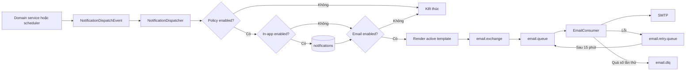

# Notification & Email Template

Tài liệu này mô tả toàn bộ phần thông báo và email template hiện có trong CareHub: phạm vi nghiệp vụ, kiến trúc, dữ liệu, API, xử lý sự kiện, scheduler, RabbitMQ, frontend, cấu hình, kiểm thử và lưu ý triển khai.

OpenAPI chi tiết nằm tại [`docs/openapi/notification-v1.yaml`](./openapi/notification-v1.yaml).

## 1. Phạm vi

Hệ thống hỗ trợ hai kênh gửi:

- **In-app notification**: lưu vào bảng `notifications` và hiển thị trong inbox của người nhận.
- **Email**: render từ email template, đẩy qua RabbitMQ và gửi bằng SMTP.

Các sự kiện nghiệp vụ được hỗ trợ:

| Event type | Danh mục | Người nhận | Mặc định | Tần suất mặc định |
| --- | --- | --- | --- | --- |
| `CME_HOURS_BELOW_REQUIREMENT` | `TRAINING` | `EMPLOYEE`, `MANAGER` | Bật | `WEEKLY` |
| `EXAM_ASSIGNED` | `EVALUATION` | `EMPLOYEE` | Bật | `IMMEDIATE` |
| `QUALITY_COMPLIANCE_BELOW_TARGET` | `QUALITY` | `MANAGER` | Bật | `DAILY` |
| `PERSONAL_COMPLIANCE_ISSUE` | `QUALITY` | `EMPLOYEE` | Tắt | `IMMEDIATE` |

Không có event, policy, email template hoặc luồng gửi thông báo cho quản lý khi nhân viên thi trượt.

## 2. Kiến trúc tổng quan



Các thành phần chính:

- `NotificationEventCatalog`: nguồn chuẩn cho category, audience, cadence và biến template.
- `NotificationPolicyService`: đọc, cập nhật và reset policy.
- `NotificationEventPublisher`: phát event từ transaction nghiệp vụ.
- `NotificationEventListener`: nhận event ở pha `AFTER_COMMIT`.
- `NotificationDispatcher`: áp dụng policy, dedup, tạo in-app notification và gửi email.
- `EmailTemplateRenderer`: kiểm tra và thay thế placeholder.
- `EmailTemplateService`: CRUD, filter, preview và chọn template đang hoạt động.
- `NotificationAlertScheduler`: quét cảnh báo CME và chất lượng.
- `EmailProducer` / `EmailConsumer`: giao tiếp RabbitMQ và SMTP.

## 3. Luồng xử lý

### 3.1. Event phát sinh trong transaction nghiệp vụ

`EXAM_ASSIGNED` và `PERSONAL_COMPLIANCE_ISSUE` được phát bằng Spring application event.

Listener dùng:

```text
@TransactionalEventListener(
    phase = AFTER_COMMIT,
    fallbackExecution = true
)
```

Vì vậy notification chỉ được dispatch sau khi transaction nghiệp vụ commit thành công. Nếu transaction rollback, event không được gửi.

### 3.2. Event theo lịch

`CME_HOURS_BELOW_REQUIREMENT` và `QUALITY_COMPLIANCE_BELOW_TARGET` do `NotificationAlertScheduler` quét theo cron.

Quy tắc cadence:

- `DAILY`: xử lý mỗi ngày.
- `WEEKLY`: chỉ xử lý vào thứ Hai.
- `MONTHLY`: chỉ xử lý ngày đầu tháng.
- `IMMEDIATE`: chỉ dùng cho event tức thời, không dùng cho event scheduler.

### 3.3. Áp dụng policy

Dispatcher thực hiện theo thứ tự:

1. Kiểm tra event và người nhận.
2. Đọc policy theo `eventType`.
3. Dừng nếu policy bị tắt.
4. Tạo dedup key có scope theo người nhận.
5. Tạo in-app notification nếu `inAppEnabled=true`.
6. Dừng nếu bản ghi cùng dedup key đã tồn tại.
7. Tìm active email template theo cặp `(eventType, audience)`.
8. Render subject/body bằng biến runtime.
9. Đẩy `EmailMessage` vào RabbitMQ nếu `emailEnabled=true` và người nhận có email.

Email xác thực như OTP/reset password được gửi trực tiếp qua email queue và không bị policy notification nghiệp vụ chặn.

## 4. Chi tiết từng event

### 4.1. `EXAM_ASSIGNED`

Nguồn phát: `ExamAssignmentService`.

Event được phát khi:

- Tạo assignment ở trạng thái `OPEN`.
- Chuyển một assignment chưa mở sang `OPEN`.

Event không phát lại nếu assignment đã ở trạng thái `OPEN`.

Người nhận: từng nhân viên thuộc assignment.

Deep link mặc định: `/staff/exam/take`.

Dedup key nghiệp vụ:

```text
EXAM_ASSIGNED:{assignmentId}:{userId}
```

### 4.2. `PERSONAL_COMPLIANCE_ISSUE`

Nguồn phát: `FormSubmissionService`.

Event được phát sau khi form submission được submit và kết quả là:

- `FAILED_SCORE`, hoặc
- `FAILED_CRITICAL`.

Người nhận là chính `subjectUser` của submission. Policy này mặc định tắt.

Dedup key nghiệp vụ:

```text
PERSONAL_COMPLIANCE:{submissionId}
```

### 4.3. `CME_HOURS_BELOW_REQUIREMENT`

Nguồn phát: `NotificationAlertScheduler`.

Scheduler lấy người dùng đang `ACTIVE`, tính trạng thái bằng `TrainingComplianceCalculator`, sau đó cảnh báo nếu trạng thái là:

- `AT_RISK`, hoặc
- `NON_COMPLIANT`.

Người nhận:

- Nhân viên bị thiếu giờ CME.
- Quản lý cùng khoa/phòng.

Nếu một tài khoản vừa là nhân viên vừa là quản lý của chính khoa/phòng đó, hệ thống bỏ qua notification quản lý tự gửi cho chính tài khoản đó.

Dedup key có chứa employee, audience và cadence bucket.

### 4.4. `QUALITY_COMPLIANCE_BELOW_TARGET`

Nguồn phát: `NotificationAlertScheduler`.

Scheduler tổng hợp form submission theo khoa/phòng trong 30 ngày gần nhất. Nếu tỷ lệ `PASSED` thấp hơn `thresholdPercent`, hệ thống gửi cảnh báo cho quản lý khoa/phòng.

Ngưỡng mặc định: `90%`.

SQL tổng hợp sử dụng cú pháp PostgreSQL (`FILTER`, cast `numeric`).

## 5. Data model

### 5.1. `notifications`

| Trường | Ý nghĩa |
| --- | --- |
| `id` | Khóa chính |
| `user_id` | Người nhận |
| `event_type` | Event nghiệp vụ; có thể null với notification legacy |
| `type` | Severity như `INFO`, `WARNING`, `SUCCESS`, `DANGER` |
| `title` | Tiêu đề in-app |
| `content` | Nội dung in-app |
| `deep_link` | Link điều hướng tùy chọn |
| `is_read` | Trạng thái đọc |
| `read_at` | Thời điểm đánh dấu đã đọc |
| `dedup_key` | Khóa chống gửi trùng, tối đa 220 ký tự |
| `created_at`, `updated_at`, `updated_by` | Audit fields |

Ràng buộc/index:

- Unique `dedup_key`.
- Index `(user_id, is_read)`.
- Index `dedup_key`.

PostgreSQL cho phép nhiều giá trị `NULL` trong unique constraint, vì vậy notification không có dedup key vẫn có thể được tạo nhiều lần.

### 5.2. `notification_policies`

| Trường | Ý nghĩa |
| --- | --- |
| `event_type` | Event duy nhất của policy |
| `enabled` | Bật/tắt toàn bộ event |
| `in_app_enabled` | Bật/tắt kênh in-app |
| `email_enabled` | Bật/tắt kênh email |
| `cadence` | `IMMEDIATE`, `DAILY`, `WEEKLY`, `MONTHLY` |
| `threshold_percent` | Chỉ dùng cho quality compliance |
| `lock_version` | Optimistic locking |

Mỗi `event_type` chỉ có một policy.

### 5.3. `email_templates`

| Trường | Ý nghĩa |
| --- | --- |
| `code` | Mã duy nhất, chỉ gồm `A-Z`, `0-9`, `_`, tối đa 80 ký tự |
| `name` | Tên hiển thị, tối đa 160 ký tự |
| `category` | `TRAINING`, `EVALUATION`, `QUALITY` |
| `event_type` | Event liên kết |
| `audience` | `EMPLOYEE`, `MANAGER`, `ADMIN` |
| `subject` | Tiêu đề email, tối đa 200 ký tự |
| `body` | Nội dung email dạng plain text |
| `mandatory` | Template hệ thống |
| `active` | Template đang hoạt động |
| `lock_version` | Optimistic locking |

Index `(event_type, audience, active)` hỗ trợ chọn template khi dispatch.

Service đảm bảo chỉ một template active cho mỗi cặp `(eventType, audience)`. Khi kích hoạt template khác, template active cũ được chuyển về inactive.

Template hệ thống:

- Không thể xóa.
- Không thể đổi `code`, `eventType` hoặc `audience`.
- Có thể sửa tên, subject, body và trạng thái active.

## 6. Email template và placeholder

Placeholder có cú pháp:

```text
{{snake_case_variable}}
```

Renderer kiểm tra cả subject và body. Các trường hợp sau trả lỗi `422`:

- Biến không nằm trong catalog của event.
- Audience không hợp lệ với event.
- Category không khớp event.
- Placeholder sai cú pháp.
- Thiếu giá trị biến khi render/preview.

### 6.1. Biến cho CME

Áp dụng cho `CME_HOURS_BELOW_REQUIREMENT`:

- `recipient_name`
- `manager_name`
- `employee_name`
- `employee_code`
- `current_hours`
- `required_hours`
- `missing_hours`
- `deadline`
- `department`

### 6.2. Biến cho giao bài thi

Áp dụng cho `EXAM_ASSIGNED`:

- `recipient_name`
- `employee_name`
- `employee_code`
- `exam_name`
- `due_at`
- `max_attempts`

### 6.3. Biến cho quality compliance

Áp dụng cho `QUALITY_COMPLIANCE_BELOW_TARGET`:

- `recipient_name`
- `manager_name`
- `department`
- `compliance_rate`
- `target_rate`
- `period`

### 6.4. Biến cho compliance cá nhân

Áp dụng cho `PERSONAL_COMPLIANCE_ISSUE`:

- `recipient_name`
- `employee_name`
- `employee_code`
- `form_name`
- `result`
- `score`
- `submitted_at`

## 7. Template hệ thống mặc định

Bootstrap tạo các template sau nếu chưa tồn tại:

| Code | Event | Audience |
| --- | --- | --- |
| `CME_DEFICIT_EMPLOYEE` | `CME_HOURS_BELOW_REQUIREMENT` | `EMPLOYEE` |
| `CME_DEFICIT_MANAGER` | `CME_HOURS_BELOW_REQUIREMENT` | `MANAGER` |
| `EXAM_ASSIGNED_EMPLOYEE` | `EXAM_ASSIGNED` | `EMPLOYEE` |
| `QUALITY_LOW_COMPLIANCE_MANAGER` | `QUALITY_COMPLIANCE_BELOW_TARGET` | `MANAGER` |
| `PERSONAL_COMPLIANCE_EMPLOYEE` | `PERSONAL_COMPLIANCE_ISSUE` | `EMPLOYEE` |

Bootstrap cũng tạo policy mặc định cho mọi event.

Bootstrap có tính idempotent theo `code`: nếu code đã tồn tại, hệ thống không tạo bản ghi trùng và không ghi đè nội dung hiện có.

## 8. API conventions

Base path:

```text
/api/v1
```

Response thành công có dạng:

```json
{
  "success": true,
  "message": "Operation completed successfully",
  "data": {}
}
```

Các API admin yêu cầu role `ADMIN`. Inbox yêu cầu người dùng đã xác thực và chỉ thao tác được trên notification của chính mình.

Phân trang dùng:

- `page`: bắt đầu từ `0`.
- `size`: từ `1` đến `100`.
- `sort`: ví dụ `updatedAt,desc`.

## 9. Inbox API

### 9.1. Danh sách notification

```http
GET /api/v1/me/notifications?page=0&size=20&q=CME&read=false
```

Response `data`:

```json
{
  "content": [
    {
      "id": 120,
      "type": "WARNING",
      "eventType": "CME_HOURS_BELOW_REQUIREMENT",
      "title": "Bạn chưa đạt yêu cầu giờ CME",
      "content": "Bạn còn thiếu 12 giờ CME.",
      "deepLink": "/staff/training",
      "read": false,
      "readAt": null,
      "createdAt": "2026-07-11T07:00:00"
    }
  ],
  "page": 0,
  "size": 20,
  "totalElements": 1,
  "totalPages": 1,
  "sort": ["createdAt,desc"]
}
```

### 9.2. Chi tiết notification

```http
GET /api/v1/me/notifications/{id}
```

GET chi tiết không tự động đánh dấu đã đọc.

### 9.3. Số chưa đọc

```http
GET /api/v1/me/notifications/unread-count
```

```json
{
  "success": true,
  "message": "Get unread notification count successfully",
  "data": {
    "unreadCount": 5
  }
}
```

### 9.4. Đánh dấu một notification

```http
PATCH /api/v1/me/notifications/{id}
Content-Type: application/json

{
  "read": true
}
```

Có thể gửi `false` để chuyển lại trạng thái chưa đọc.

### 9.5. Đánh dấu toàn bộ inbox

```http
PATCH /api/v1/me/notifications/read-status
Content-Type: application/json

{
  "read": true
}
```

Response `data` là số bản ghi đã cập nhật.

### 9.6. Xóa notification

```http
DELETE /api/v1/me/notifications/{id}
```

Response: `204 No Content`.

Endpoint legacy sau vẫn được giữ để tương thích ngược nhưng frontend mới không sử dụng:

```http
POST /api/v1/me/notifications/{id}/action
```

## 10. Notification policy API

### 10.1. Lấy cấu hình

```http
GET /api/v1/notifications/config
```

### 10.2. Cập nhật cấu hình

```http
PUT /api/v1/notifications/config
Content-Type: application/json
```

Payload phải chứa đúng một policy cho mọi event đang được hỗ trợ:

```json
{
  "policies": [
    {
      "eventType": "CME_HOURS_BELOW_REQUIREMENT",
      "enabled": true,
      "inAppEnabled": true,
      "emailEnabled": true,
      "cadence": "WEEKLY",
      "thresholdPercent": null,
      "version": 0
    },
    {
      "eventType": "EXAM_ASSIGNED",
      "enabled": true,
      "inAppEnabled": true,
      "emailEnabled": true,
      "cadence": "IMMEDIATE",
      "thresholdPercent": null,
      "version": 0
    },
    {
      "eventType": "QUALITY_COMPLIANCE_BELOW_TARGET",
      "enabled": true,
      "inAppEnabled": true,
      "emailEnabled": true,
      "cadence": "DAILY",
      "thresholdPercent": 90,
      "version": 0
    },
    {
      "eventType": "PERSONAL_COMPLIANCE_ISSUE",
      "enabled": false,
      "inAppEnabled": true,
      "emailEnabled": true,
      "cadence": "IMMEDIATE",
      "thresholdPercent": null,
      "version": 0
    }
  ]
}
```

Quy tắc validation:

- Không được thiếu hoặc lặp event.
- Event tức thời chỉ được dùng `IMMEDIATE`.
- Event scheduler không được dùng `IMMEDIATE`.
- `thresholdPercent` nằm trong khoảng `0..100`.
- `version` cũ trả `409 Conflict`.

### 10.3. Reset mặc định

```http
PUT /api/v1/notifications/config/defaults
```

## 11. Event metadata API

Frontend tạo/sửa email template lấy event, category, audience và allowed variables từ:

```http
GET /api/v1/notification-events
```

Ví dụ:

```json
{
  "success": true,
  "message": "Get notification event definitions successfully",
  "data": [
    {
      "eventType": "EXAM_ASSIGNED",
      "displayName": "Thông báo giao bài thi",
      "category": "EVALUATION",
      "audiences": ["EMPLOYEE"],
      "defaultCadence": "IMMEDIATE",
      "allowedVariables": [
        "due_at",
        "employee_code",
        "employee_name",
        "exam_name",
        "max_attempts",
        "recipient_name"
      ]
    }
  ]
}
```

## 12. Email template API

### 12.1. Danh sách và filter

```http
GET /api/v1/email/templates?page=0&size=20&sort=updatedAt,desc
GET /api/v1/email/templates?q=CME&category=TRAINING&active=true
GET /api/v1/email/templates?eventType=EXAM_ASSIGNED
```

Các filter:

- `q`: tìm theo code, name hoặc subject.
- `category`: `TRAINING`, `EVALUATION`, `QUALITY`.
- `eventType`: một giá trị trong event catalog.
- `active`: `true` hoặc `false`.

### 12.2. Chi tiết

```http
GET /api/v1/email/templates/{id}
```

Response có thêm metadata:

- `triggerLabel`
- `mandatory`
- `systemManaged`
- `editable`
- `deletable`
- `allowedVariables`
- `version`

### 12.3. Tạo template

```http
POST /api/v1/email/templates
Content-Type: application/json
```

```json
{
  "code": "CUSTOM_EXAM_ASSIGNED",
  "name": "Thông báo bài thi dành cho điều dưỡng",
  "category": "EVALUATION",
  "eventType": "EXAM_ASSIGNED",
  "audience": "EMPLOYEE",
  "subject": "[VietDuc] Bài thi mới: {{exam_name}}",
  "body": "Kính gửi {{recipient_name}},\nBạn cần hoàn thành bài thi trước {{due_at}}.",
  "active": true,
  "version": null
}
```

Response: `201 Created` và có header `Location`.

### 12.4. Cập nhật template

```http
PUT /api/v1/email/templates/{id}
Content-Type: application/json
```

Payload giống create và phải gửi `version` mới nhất để phát hiện cập nhật đồng thời.

### 12.5. Xóa template

```http
DELETE /api/v1/email/templates/{id}
```

- Template tự tạo: `204 No Content`.
- Template hệ thống: `409 Conflict`.

### 12.6. Preview template

```http
POST /api/v1/email/template-previews
Content-Type: application/json
```

```json
{
  "eventType": "EXAM_ASSIGNED",
  "audience": "EMPLOYEE",
  "subject": "Bài thi {{exam_name}}",
  "body": "Chào {{recipient_name}}, hạn hoàn thành {{due_at}}.",
  "variables": {
    "exam_name": "An toàn người bệnh",
    "recipient_name": "Nguyễn Văn A",
    "due_at": "2026-07-15"
  }
}
```

Response:

```json
{
  "success": true,
  "message": "Preview email template successfully",
  "data": {
    "subject": "Bài thi An toàn người bệnh",
    "body": "Chào Nguyễn Văn A, hạn hoàn thành 2026-07-15."
  }
}
```

## 13. HTTP status và lỗi

| Status | Trường hợp |
| --- | --- |
| `200` | GET, PUT, PATCH thành công |
| `201` | Tạo email template thành công |
| `204` | Xóa thành công |
| `400` | JSON hoặc validation cơ bản không hợp lệ |
| `401` | Chưa xác thực |
| `403` | Không có role phù hợp |
| `404` | Không tìm thấy resource trong scope người dùng |
| `409` | Trùng code, version cũ hoặc thao tác bị khóa trên template hệ thống |
| `422` | Event/category/audience/cadence/placeholder không hợp lệ |

## 14. RabbitMQ và email retry

Queue/exchange:

| Thành phần | Giá trị |
| --- | --- |
| Main exchange | `email.exchange` |
| Main queue | `email.queue` |
| Main routing key | `email.routing.key` |
| Retry exchange | `email.retry.exchange` |
| Retry queue | `email.retry.queue` |
| Retry routing key | `email.retry.routing.key` |
| DLQ exchange | `email.dlq.exchange` |
| DLQ | `email.dlq` |
| DLQ routing key | `email.dlq.routing.key` |

Retry queue có TTL 15 phút. Sau TTL, message được dead-letter về main exchange để gửi lại.

`EmailConsumer`:

- Dùng manual acknowledgement.
- Gửi thành công thì ACK message.
- Gửi lỗi thì tăng `attempts`, đẩy vào retry queue và ACK message hiện tại.
- Từ lần thất bại thứ 5, message được chuyển vào DLQ.

Email hiện được gửi dưới dạng plain text bằng `SimpleMailMessage`.

## 15. Dedup và idempotency

Dispatcher thêm scope người nhận vào dedup key:

```text
{recipientUserId}:{businessDedupKey}
```

Key được cắt tối đa 220 ký tự và có unique constraint trong bảng `notifications`.

Nếu in-app channel đang bật, một notification trùng dedup key sẽ làm dispatcher dừng trước khi gửi email, nhờ đó in-app và email không bị lặp trong cùng cadence bucket.

Giới hạn hiện tại:

- Nếu `inAppEnabled=false` nhưng `emailEnabled=true`, chưa có bảng email delivery log riêng để chống gửi email trùng sau restart hoặc retry ở tầng business.
- RabbitMQ retry xử lý lỗi gửi SMTP, nhưng không thay thế một transactional outbox.

Nếu cần đảm bảo exactly-once ở mức cao hơn, nên bổ sung `notification_delivery` hoặc outbox table với unique key `(recipient, eventType, businessKey, channel)`.

## 16. Frontend integration

### 16.1. Admin

- `NotificationSettingsPage.jsx`
  - Đọc và lưu policy từ backend.
  - Reset bằng endpoint defaults.
  - Không dùng localStorage.
- `EmailTemplatesListPage.jsx`
  - Phân trang và filter phía server.
  - Không fallback sang mock data.
  - Disable nút xóa cho system template.
- `EmailTemplateFormPage.jsx`
  - Lấy event metadata từ `/notification-events`.
  - Hiển thị đúng audience và allowed variables.
  - Gửi `version` khi update.

### 16.2. User inbox

- `useNotifications.js`
  - Lấy danh sách và unread count.
  - Dùng PATCH mới cho read status.
- `NotificationsStaffScreen.jsx`
  - Filter/pagination phía server.
  - GET detail không làm thay đổi dữ liệu.
  - PATCH read status sau khi mở notification.
- `Header.jsx` và `AdminHeader.jsx`
  - Hiển thị popover và badge unread.

## 17. Cấu hình môi trường

### 17.1. Notification

| Biến | Mặc định | Ý nghĩa |
| --- | --- | --- |
| `APP_NOTIFICATION_SEED_ENABLED` | `true` | Tạo policy và system template mặc định |
| `APP_NOTIFICATION_SCHEDULING_ENABLED` | `true` | Bật scheduler cảnh báo |
| `APP_NOTIFICATION_SCAN_CRON` | `0 0 7 * * *` | Cron quét cảnh báo |
| `APP_NOTIFICATION_ZONE` | `Asia/Bangkok` | Timezone cho cron và khoảng thời gian nghiệp vụ |

### 17.2. RabbitMQ

```text
CLOUDAMQP_URL=amqps://...
```

### 17.3. SMTP

```text
MAIL_HOST=smtp.gmail.com
MAIL_PORT=587
MAIL_USERNAME=...
MAIL_PASSWORD=...
```

SMTP bật authentication và STARTTLS.

## 18. Database và migration

Project hiện sử dụng:

```yaml
spring:
  jpa:
    hibernate:
      ddl-auto: update
```

Khi chạy phiên bản này lần đầu, Hibernate sẽ:

- Tạo bảng `notification_policies`.
- Bổ sung metadata và `lock_version` cho `email_templates`.
- Bổ sung `event_type` cho `notifications`.
- Tạo các index mới.

Khuyến nghị trước khi deploy production:

1. Backup database.
2. Kiểm tra trước DDL được sinh trên staging.
3. Đảm bảo PostgreSQL user có quyền `ALTER TABLE` và `CREATE INDEX`.
4. Sau khi ổn định, chuyển thay đổi schema thành migration Flyway/Liquibase thay vì phụ thuộc dài hạn vào `ddl-auto=update`.

Template legacy có thể có `name`, `category`, `eventType` hoặc `audience` bằng null. Các template này vẫn được hiển thị, nhưng không được dispatcher chọn cho đến khi được mở và lưu lại với binding hợp lệ.

Nếu database cũ có bảng singleton `notification_configs`, bảng đó không còn được sử dụng; policy mới nằm trong `notification_policies`. Hibernate `ddl-auto=update` không tự xóa bảng legacy này.

## 19. Kiểm thử

Các kiểm tra đã chạy:

- Toàn bộ backend: `192` test, `0` failure, `0` error, `2` smoke test skip.
- Renderer và exam assignment event: `6/6` test thành công.
- Spring context với Hibernate `create-drop`: thành công.
- Frontend ESLint trên các file notification/template thay đổi: thành công.
- Frontend production build: thành công.

Lệnh tham khảo trên Windows PowerShell:

```powershell
$env:JAVA_HOME='C:\Program Files\Java\jdk-17'
.\mvnw.cmd "-Dspring.profiles.active=test" test
```

```powershell
npm run build
```

Test backend phải chạy với profile `test`. `CarehubBackendApplicationTests` chỉ kiểm tra context startup, không đọc, xóa hoặc seed database developer.

## 20. Checklist triển khai

- [ ] Backup PostgreSQL.
- [ ] Kiểm tra `DB_URL`, `DB_USERNAME`, `DB_PASSWORD`.
- [ ] Kiểm tra kết nối RabbitMQ bằng `CLOUDAMQP_URL`.
- [ ] Kiểm tra SMTP và gửi thử email.
- [ ] Xác nhận system templates đã được bootstrap.
- [ ] Xác nhận đủ 4 policy trong `notification_policies`.
- [ ] Xác nhận cron/timezone đúng môi trường.
- [ ] Kiểm tra user có email hợp lệ.
- [ ] Kiểm tra manager đã được gán role `MANAGER` và đúng department.
- [ ] Theo dõi `email.retry.queue` và `email.dlq`.
- [ ] Kiểm tra inbox, unread count và thao tác read/delete.
- [ ] Kiểm tra template legacy và bind lại nếu cần.

## 21. Troubleshooting

### Không có in-app notification

Kiểm tra:

1. Policy `enabled` và `inAppEnabled`.
2. Recipient còn tồn tại và chưa bị xóa.
3. Dedup key đã tồn tại trong `notifications` hay chưa.
4. Event nghiệp vụ có thực sự commit hay không.

### Có in-app nhưng không có email

Kiểm tra:

1. Policy `emailEnabled`.
2. User có email.
3. Có active template đúng `(eventType, audience)`.
4. Placeholder có đủ biến runtime.
5. RabbitMQ main/retry/DLQ.
6. SMTP credentials và STARTTLS.

### Template trả `422`

Kiểm tra:

- Category có khớp event.
- Audience có được event hỗ trợ.
- Cadence có phù hợp event.
- Placeholder dùng đúng snake_case.
- Preview payload có đủ biến được sử dụng trong subject/body.

### Update trả `409`

Client đang gửi `version` cũ hoặc code template bị trùng. Tải lại resource mới nhất trước khi lưu lại.

## 22. Các file chính

Backend:

- `notification/controller/NotificationController.java`
- `notification/entity/Notification.java`
- `notification/entity/NotificationConfig.java`
- `notification/entity/EmailTemplate.java`
- `notification/service/NotificationService.java`
- `notification/service/NotificationPolicyService.java`
- `notification/service/NotificationEventCatalog.java`
- `notification/service/NotificationDispatcher.java`
- `notification/service/NotificationAlertScheduler.java`
- `notification/service/NotificationBootstrap.java`
- `notification/service/EmailTemplateService.java`
- `notification/service/EmailTemplateRenderer.java`
- `notification/messaging/NotificationDispatchEvent.java`
- `notification/messaging/NotificationEventPublisher.java`
- `notification/messaging/NotificationEventListener.java`
- `notification/messaging/EmailProducer.java`
- `notification/messaging/EmailConsumer.java`
- `config/RabbitMQConfig.java`
- `questiongeneration/service/ExamAssignmentService.java`
- `form/submission/service/FormSubmissionService.java`

Frontend:

- `features/admin/api/adminApi.js`
- `features/admin/pages/NotificationSettingsPage.jsx`
- `features/admin/pages/EmailTemplatesListPage.jsx`
- `features/admin/pages/EmailTemplateFormPage.jsx`
- `features/staff/hooks/useNotifications.js`
- `features/staff/pages/NotificationsStaffScreen.jsx`
- `features/staff/components/Header.jsx`
- `features/admin/components/AdminHeader.jsx`

## 23. Cách thêm event mới

1. Thêm enum vào `NotificationEventType`.
2. Khai báo category, audience, default cadence, default enabled, threshold và variables trong `NotificationEventCatalog`.
3. Thêm system template trong `NotificationBootstrap` nếu cần email mặc định.
4. Phát `NotificationDispatchEvent` từ domain service hoặc bổ sung logic scheduler.
5. Bổ sung deep link và dedup key ổn định.
6. Cập nhật OpenAPI.
7. Bổ sung test renderer, event publisher và policy.
8. Kiểm tra event metadata trên frontend; form template sẽ tự lấy metadata từ backend.

Không thêm event chỉ ở frontend hoặc localStorage vì backend catalog là nguồn dữ liệu chuẩn.
