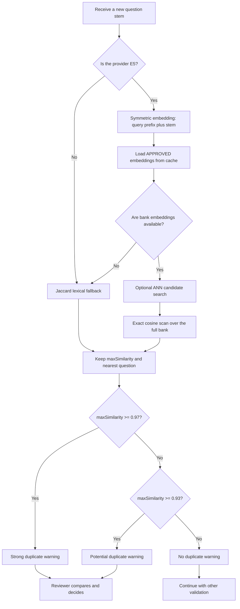

# CareHub — Semantic Duplicate Question Detection

## 1. Presentation summary

CareHub uses `intfloat/multilingual-e5-small` to identify questions that assess the same knowledge even when they are worded differently. The model converts each question stem into a 384-dimensional vector. The system compares a new vector with every approved question and keeps the highest cosine similarity.

The model produces vectors and similarity scores; it does not define what counts as a duplicate. CareHub applies two operational thresholds:

| Highest cosine score | System behavior |
|---|---|
| `< 0.93` | No semantic-duplicate warning |
| `0.93 to below 0.97` | “Potential duplicate” warning |
| `>= 0.97` | “Strong duplicate” warning |

Both levels are warnings. A high cosine score does not automatically reject a question. A reviewer compares the question stems, answer options, and correct answers before deciding.

The current thresholds were calibrated on 457 `APPROVED` questions from PostgreSQL:

- 104,196 unique pairs were measured;
- the active threshold `0.93` flags 125 of 457 questions by nn-max, or 27.4%;
- `0.95`, used until 2026-08-25, flagged 27 of 457 questions, or 5.9%;
- `0.97` produced a strong warning for 10 of 457 questions, or 2.2%;
- the dataset does not yet have expert-labelled ground truth, so the project cannot claim a precision, recall, or “95% accuracy” figure.

## 2. Problem definition

### 2.1. What does “duplicate” mean in CareHub?

Two questions are duplicate candidates when they assess the same knowledge or require the same professional decision, even if they use different wording.

Example:

> How many identifiers must be checked to identify a patient correctly?

> How many identifying factors should be used to verify a patient's identity?

Keyword overlap may be low, while a semantic embedding model can place both questions close together because they ask for the same information.

### 2.2. Cases that cosine can misclassify

A high cosine score is not proof of duplication. Common failure cases include:

- the same question template applied to different clinical contexts;
- the same topic but a different knowledge target;
- changed negation or clinical direction, such as “early” versus “late”;
- changed strength, such as “recommended,” “mandatory,” and “highest priority”;
- similar stems whose options and correct answers assess different outcomes.

This is why the final design is **model-assisted review, not model-made rejection**.

## 3. How the flow was built

### Step 1 — Keyword matching as a baseline and fallback

The simplest implementation uses Jaccard similarity over token sets:

\[
J(A,B)=\frac{|A\cap B|}{|A\cup B|}
\]

Text is normalized, accents are removed, and tokens are compared as sets. This method is fast and requires no model, but it misses semantic duplicates that use different vocabulary.

CareHub retains Jaccard as a fallback when E5 is unavailable or the approved bank has no embeddings. The current lexical thresholds are:

- `lexical-review-min = 0.50`;
- `lexical-strong-min = 0.80`.

Jaccard and E5 cosine use different score distributions, so their thresholds are intentionally separate.

### Step 2 — E5 semantic representations

`intfloat/multilingual-e5-small` maps each stem to a 384-dimensional vector. The ONNX pipeline performs the following operations:

1. normalize Unicode to NFC;
2. collapse whitespace and lowercase the text;
3. prepend `query: `;
4. tokenize and truncate to at most 512 tokens;
5. run ONNX Runtime inference;
6. mean-pool token embeddings using the attention mask;
7. L2-normalize the final vector.

Because the vectors are L2-normalized, cosine similarity reduces to a dot product:

\[
\operatorname{cosine}(x,y)
=\frac{x\cdot y}{\|x\|\|y\|}
=x\cdot y
\]

### Step 3 — Symmetric embedding for question-to-question comparison

Duplicate detection compares two objects of the same type: one question against another question. Both sides must therefore use the same `query:` prefix.

The previous flow embedded the new question as a query and stored bank questions as passages. On the 457-question calibration corpus, this asymmetric setup reduced cosine scores by 0.0088 on average and shifted the meaning of every threshold.

CareHub introduced `text_type = stem_sym_v2` for the corrected representation. Changing the versioned text type forces a backfill instead of mixing legacy and current vectors.

### Step 4 — Persistent embeddings and complete backfill

Each approved question embedding is stored with:

- the question ID;
- text type `stem_sym_v2`;
- model name;
- embedding dimension;
- a SHA-256 hash of normalized input text;
- binary and JSON vector forms.

At application startup, a background backfill processes all `APPROVED` questions in batches. Rows with the expected model, text type, and input hash are skipped. This also repairs questions created while E5 was disabled or unavailable.

If backfill completes only partially, questions without vectors do not participate in semantic comparison. The startup component warns when the embedding count is lower than the `APPROVED` question count; operators must complete backfill rather than assume full coverage.

When a new question is approved, its vector is appended to the cache only after the database transaction commits. When a stem changes or a question leaves `APPROVED`, the cache is invalidated so the system cannot compare against stale vectors or rolled-back data.

### Step 5 — Cache and optional ANN index

Approved embeddings are held in a Caffeine cache with a default 30-minute TTL. The cache maintains a `dataVersion`, and the ANN index rebuilds against that version. Counting rows is insufficient because editing a stem changes its vector without changing the number of questions.

CareHub includes an LSH random-projection ANN index. Calibration showed low recall@1 at the current bank size. With 16 hash bits and `searchK=50`, measured recall@1 was 0.217.

As a result:

- `E5_ANN_ENABLED=false` is the current default;
- if ANN is enabled, `DuplicateCheckService` still performs a full exact scan after ANN;
- ANN-only retrieval should be considered only after the bank grows substantially and is benchmarked again.

### Step 6 — Duplicate checks within one generated batch

When AI generation returns several questions in one response, CareHub batch-embeds all stems and compares each question with earlier questions in that response. The first occurrence remains the reference; later near-duplicates receive a warning.

This prevents two generated questions from bypassing duplicate detection simply because neither has entered the question bank yet.

### Step 7 — Calibrate nearest-neighbor maxima, not independent pairs

At runtime, the system compares a new question with the entire bank and uses the maximum score:

\[
s(q)=\max_{d\in D}\operatorname{cosine}(q,d)
\]

The matching calibration statistic is the **nearest-neighbor maximum**, abbreviated as nn-max. For every question in the corpus, calibration excludes that question, compares it with all remaining questions, and retains its highest score.

Selecting a threshold from the percentage of independent pairs above that threshold understates review workload. A question has hundreds of opportunities to find at least one close neighbor.

### Step 8 — Remove automatic rejection based on cosine

Very high scores can still come from shared templates rather than duplicate meaning. Without sufficiently strong ground truth to prove a safe auto-rejection boundary, CareHub uses two warnings:

- `reviewMin = 0.93` routes attention to a candidate pair;
- `strongMin = 0.97` highlights a rarer and more suspicious pair.

`strongDuplicate=true` means “the score crossed the strong-warning threshold.” It does not mean “the model proved that these questions are duplicates.”

## 4. Runtime flow for one question



### 4.1. Inputs

The principal input is a question `stem`. Depending on the calling flow, the service also receives:

- `excludedQuestionIds`, used to exclude the question currently being edited;
- `excludedCandidateIds`, used by the lexical path to exclude the current candidate;
- `precomputedVector`, produced by batch embedding to avoid another model call.

### 4.2. Output

`DuplicateCheckResult` contains:

| Field | Meaning |
|---|---|
| `maxSimilarity` | Highest score found |
| `matchedQuestionId` | ID of the nearest bank question |
| `matchedQuestionStem` | Stem snapshot shown to the reviewer |
| `needsReview` | Score crossed the review threshold |
| `strongDuplicate` | Score crossed the strong-warning threshold |
| `warning` | Fallback or duplicate-related message |
| `checker` | Execution path: `e5`, `e5-exact`, `e5-ann`, `e5-batch`, `lexical`, or `lexical-fallback` |

The E5 score currently covers the **stem only**. The four options and correct answer are not concatenated into the embedding. They are shown to the reviewer so that questions with similar stems but different assessment targets can be distinguished.

### 4.3. Pseudocode

```text
function checkDuplicate(stem, excludedIds, optionalVector):
    if provider != E5:
        return lexicalCheck(stem)

    try:
        queryVector = optionalVector ?? embedSymmetric(stem)
        bank = cachedApprovedEmbeddings()

        if bank is empty:
            return lexicalFallback(stem)

        best = ANN candidate if ANN is enabled
        best = exactMaxCosine(queryVector, bank, excludedIds, startingAt=best)

        return {
            maxSimilarity: best.score,
            needsReview: best.score >= 0.93,
            strongDuplicate: best.score >= 0.97,
            matchedQuestion: best.question,
            checker: best.source
        }
    catch modelError:
        return lexicalFallback(stem, warning=modelError)
```

## 5. Where the numbers came from

### 5.1. Latest calibration corpus

The latest recorded calibration used all 457 `APPROVED` questions in PostgreSQL at run time, grouped into six source categories.

The number of unique pairs is:

\[
\frac{457\times456}{2}=104{,}196
\]

### 5.2. Distribution over all pairs

Both sides used the symmetric `query:` representation:

| Percentile | p50 | p75 | p90 | p95 | p99 | max |
|---|---:|---:|---:|---:|---:|---:|
| Cosine | 0.837 | 0.855 | 0.874 | 0.886 | 0.908 | 0.977 |

The high baseline shows why a generic rule such as “0.8 is highly similar” is invalid for this model and corpus. Here, 0.8 is close to the background region.

### 5.3. Nearest-neighbor maximum distribution

| Percentile | min | p05 | p25 | p50 | p75 | p90 | p95 | max |
|---|---:|---:|---:|---:|---:|---:|---:|---:|
| nn-max | 0.854 | 0.874 | 0.894 | 0.914 | 0.934 | 0.946 | 0.954 | 0.977 |

Even the most isolated question has a nearest neighbor at 0.854. The median nearest-neighbor score is 0.914.

### 5.4. Review workload by threshold

| Threshold | Flagged questions | Rate |
|---:|---:|---:|
| 0.90 | 308/457 | 67.4% |
| 0.92 | 184/457 | 40.3% |
| 0.93 | 125/457 | 27.4% |
| 0.95 | 27/457 | 5.9% |
| 0.97 | 10/457 | 2.2% |

`reviewMin = 0.93` sits between the p70 (0.914) and p80 (0.934) nn-max values. The earlier 0.95 (p90 0.946 rounded up) left reviewers with almost no warnings in practice, so it was lowered to 0.93 on 2026-08-25 to trade queue size for coverage. `strongMin = 0.97` defines a rarer warning tier; it is not a scientifically proven duplicate boundary.

### 5.5. Measured runtime figures

On the calibration machine with eight available CPUs, Java 21, and a 7.9 GB maximum heap:

- model load plus first embedding: approximately 2,966 ms;
- symmetric batch embedding of 457 questions: 5,399 ms, or 11.8 ms per question;
- single embedding: p50 12.9 ms, p95 24.7 ms, mean 14.6 ms;
- batch-versus-single cosine for the same stem: mean and minimum both 1.000000.

These are measurements from one machine and one data snapshot, not a production SLA.

## 6. Code map

| Responsibility | File/class | Main method or setting |
|---|---|---|
| E5 preprocessing | `E5TextPreprocessor` | `normalize`, `symmetric` |
| ONNX inference | `E5EmbeddingModelService` | `embedSymmetric`, `embedSymmetricBatch`, mean pooling, L2 normalization |
| Persistence and backfill | `QuestionEmbeddingService` | `saveStemEmbedding`, `refreshStemEmbedding`, `backfillApprovedQuestionEmbeddings` |
| Startup backfill | `QuestionEmbeddingStartupBackfill` | `backfillAfterStartup` |
| Approved-bank cache | `EmbeddingCache` | `approvedStemEmbeddings`, `appendAfterCommit`, `invalidate` |
| Optional LSH index | `AnnEmbeddingIndex` | `rebuild`, `searchBestMatch` |
| Cosine calculation | `CosineUtil` | `cosine` |
| Warning decision | `DuplicateCheckService` | `check`, `semanticCheck`, `exactScan`, `checkWithinBatch`, `findPotentialMatches` |
| Model configuration | `AiEmbeddingProperties` / `application.yaml` | `ai.embedding.*` |
| Threshold configuration | `ValidationRulesProperties` / `application.yaml` | `validation.duplicate.*` |
| Backend result | `DuplicateCheckResult` | score, nearest match, flags, checker |
| Document question review | `DocumentQuestionJobService`, `CandidateReviewService` | route suspicious candidates to `NEED_REVIEW` |
| Question bank | `QuestionBankService` | check on create, update, and approval; return warnings |
| Paraphrase flow | `ParaphraseValidationService` | warn when a variant is close to another bank question |
| Frontend display | `duplicateQuestionUi.js`, `DocumentQuestionJobReviewPage.jsx` | badges, percentages, match list |
| Calibration | `E5SimilarityCalibrationTest` | pair distribution, nn-max, ANN recall, report generation |

The relevant source roots are:

- backend: `carehub-backend/src/main/java/vn/vietduc/carehubbackend/questiongeneration/`;
- frontend: `carehub-frontend/src/features/evaluation/`;
- calibration test: `carehub-backend/src/test/java/vn/vietduc/carehubbackend/questiongeneration/modelruntime/e5/`.

## 7. Behavior in each business flow

### 7.1. Creating, editing, or approving a bank question

`QuestionBankService` calls duplicate detection before persistence. When a question is edited or approved, its own ID is excluded. The API returns the warning and nearest question; cosine does not block the action.

During bulk import, a strong-warning row may be stored as `DRAFT` for review instead of entering `APPROVED` immediately. The row is not deleted or rejected.

### 7.2. Generating questions from documents

All stems in one response are batch-embedded. Each candidate is compared with:

1. the approved question bank;
2. earlier candidates in the same response.

A score of at least 0.93 routes the candidate to `NEED_REVIEW`. The reviewer sees the highest score, a warning badge, and a list of close questions. Editing, approval, and rejection remain reviewer actions.

Other validation rules, such as missing answers, invalid grounding, or malformed structure, can still reject a candidate. The no-auto-rejection rule applies specifically to duplicate similarity.

### 7.3. Paraphrasing

A paraphrase is compared with other bank questions while its source question is excluded through `excludedQuestionIds`. Duplicate similarity remains a reviewer aid; every otherwise valid AI paraphrase currently requires human review before use.

## 8. Important configuration

```yaml
ai:
  embedding:
    provider: e5
    model: intfloat/multilingual-e5-small
    dimension: 384
    backfill-on-startup: true
    batch-size: 32
    ann-enabled: false

validation:
  duplicate:
    review-min: 0.93
    strong-min: 0.97
    lexical-review-min: 0.50
    lexical-strong-min: 0.80
```

Relevant environment variables:

- `EMBEDDING_PROVIDER`;
- `E5_MODEL_PATH`;
- `E5_BACKFILL_ON_STARTUP`;
- `E5_ANN_ENABLED`;
- `VALIDATION_DUPLICATE_REVIEW_MIN`;
- `VALIDATION_DUPLICATE_STRONG_MIN`;
- `VALIDATION_DUPLICATE_LEXICAL_REVIEW_MIN`;
- `VALIDATION_DUPLICATE_LEXICAL_STRONG_MIN`.

## 9. Re-running calibration

### PowerShell on Windows

```powershell
cd carehub-backend
$env:RUN_E5_CALIBRATION = 'true'
$env:E5_CALIBRATION_DB = 'true'
.\mvnw.cmd test '-Dtest=E5SimilarityCalibrationTest'
```

### Bash

```bash
cd carehub-backend
RUN_E5_CALIBRATION=true \
E5_CALIBRATION_DB=true \
./mvnw test -Dtest=E5SimilarityCalibrationTest
```

Requirements:

- `model.onnx` and `tokenizer.json` must exist under `models/intfloat/multilingual-e5-small/onnx/`;
- the configured PostgreSQL database must be reachable;
- the database must contain at least two `APPROVED` questions.

The report is written to `developer_docs/ai/benchmarks/hieu-chinh-nguong-trung-lap-e5.md`.

Without `E5_CALIBRATION_DB=true`, the test uses the seeded `hospital-review-questions.json` corpus.

## 10. Tests protecting the flow

The relevant tests cover:

- exact boundaries at 0.93 and 0.97;
- strong duplicates producing warnings rather than automatic rejection;
- exclusion of the question currently being edited;
- exact scan finding the true maximum even when ANN returns a weaker candidate;
- lexical fallback when E5 fails or no embeddings exist;
- duplicate checks within a generated batch;
- cache invalidation after status or stem changes;
- agreement between batch and single embedding paths;
- the reviewer UI remaining actionable for strong-warning candidates.

Run the focused backend tests with:

```powershell
cd carehub-backend
.\mvnw.cmd test '-Dtest=DuplicateCheckServiceTest,E5SimilarityCalibrationTest'
```

The calibration test skips unless `RUN_E5_CALIBRATION=true` is set.

## 11. What has and has not been demonstrated

### Demonstrated by code and measurement

- both sides use the same symmetric representation;
- batch and single embeddings agree on the measured corpus;
- runtime obtains the true maximum through exact scan;
- thresholds 0.93 and 0.97 create warning workloads of approximately 27.4% and 2.2% by nn-max on the 457-question snapshot; across 1,168 document-generated candidates the same thresholds yield 6.6% and 1.1%;
- duplicate similarity does not automatically reject a question.

### Not yet demonstrated

- precision: how many flagged pairs are real duplicates;
- recall: how many duplicates remain below 0.93;
- F1 or a threshold optimized against expert labels;
- threshold stability at thousands or tens of thousands of questions;
- accuracy when only lexical fallback is available.
- the effect of scoring stems without options or correct answers;
- coverage while backfill is incomplete or individual backfill rows have failed.

## 12. Ground truth required for actual accuracy metrics

Ground truth is an expert label assigned to each question pair:

- `DUPLICATE`: both questions assess the same knowledge and are interchangeable;
- `NOT_DUPLICATE`: they differ in knowledge, context, timing, strength, or answer;
- `UNSURE`: a second reviewer must adjudicate.

An initial evaluation set should contain 150–200 pairs sampled across the `0.93–0.99` range, plus a below-0.93 group to measure false negatives. Reviewers should not see cosine scores during labelling. That dataset can then support precision, recall, F1, and a precision–recall curve for threshold selection.

## 13. When to recalibrate

Re-run calibration after any of the following changes:

- a substantial increase in the number of `APPROVED` questions;
- a model or ONNX file change;
- a change to preprocessing, pooling, maximum length, or prefixes;
- a major shift in clinical specialties represented in the bank;
- a change in review capacity or target warning rate;
- availability of new ground-truth labels.

As the bank grows, nn-max tends to rise because every question gets more opportunities to find a close neighbor. The value `0.93` is calibrated for the current snapshot; it is not a permanent constant of E5.

## 14. Three-to-five-minute presentation script

1. **Problem:** keyword matching misses semantically equivalent questions written with different vocabulary.
2. **Model:** E5 turns each stem into a 384-dimensional vector; cosine measures the angle between vectors.
3. **Runtime:** a new question is compared with every `APPROVED` question, and the nearest question is returned.
4. **Calibration:** thresholds use nn-max over 457 questions, not independent-pair rates; 0.93 creates a 27.4% warning rate and 0.97 creates a 2.2% strong-warning rate.
5. **Safety:** high cosine still produces false positives, so the system warns and the reviewer decides.
6. **Limitation:** no expert-labelled ground truth exists yet, so precision and recall cannot be claimed; the next step is to label 150–200 pairs.

## 15. Likely defense questions

### “Does the model provide the 0.93 threshold?”

No. The model returns vectors. CareHub chooses 0.93 from the nn-max distribution and the review workload the team can handle.

### “Why not use 0.8?”

The median score across all 104,196 pairs is already 0.837. For this model and corpus, 0.8 is close to background similarity and would flood the review queue.

### “Why use the maximum score?”

A new question only needs to duplicate one existing question to warrant review. Runtime returns the nearest neighbor, so calibration must measure that same statistic.

### “Does 0.97 guarantee a duplicate?”

No. It is a strong-warning tier. Questions with the same template or topic can score highly while assessing different content.

### “Can ANN miss a duplicate?”

ANN is disabled by default. When enabled, the service still exact-scans the full set after ANN, so the final result does not depend on ANN recall.

### “What happens if E5 fails?”

The system records a warning and switches to Jaccard lexical fallback. The `checker` field identifies which path produced the result.

### “What is the current accuracy?”

There is no defensible accuracy number yet. The project has measured warning rates on real data but lacks expert labels for precision and recall.

### “Why not reject strong duplicates automatically?”

A false positive could silently discard a valid clinical question. A false warning costs one reviewer action, so the system deliberately leaves the decision to a person.

## 16. Repository evidence

- Latest E5 report: `developer_docs/ai/benchmarks/hieu-chinh-nguong-trung-lap-e5.md`.
- Jaccard report: `developer_docs/ai/benchmarks/hieu-chinh-nguong-trung-lap-lexical-jaccard.md`.
- Calibration test: `E5SimilarityCalibrationTest.java`.
- Runtime decision logic: `DuplicateCheckService.java`.
- Runtime configuration: `carehub-backend/src/main/resources/application.yaml`.

The core sequence to remember is: **384 dimensions → cosine → nn-max → 0.93/0.97 → warnings only → reviewer decision**.
