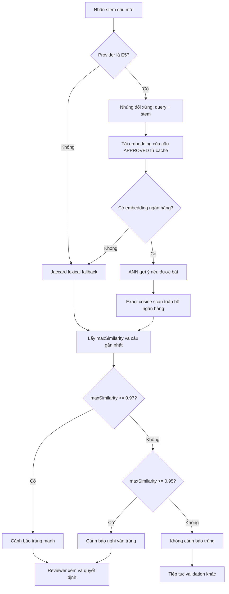

# CareHub — Hệ thống phát hiện câu hỏi trùng ngữ nghĩa

## 1. Tóm tắt dành cho thuyết trình

CareHub dùng model `intfloat/multilingual-e5-small` để phát hiện hai câu hỏi cùng hỏi một kiến thức dù cách diễn đạt khác nhau. Mỗi câu hỏi được chuyển thành vector 384 chiều; hệ thống tính cosine giữa câu mới và toàn bộ câu hỏi đã duyệt, sau đó lấy điểm lớn nhất.

Model chỉ tạo vector và điểm tương đồng. Hai ngưỡng nghiệp vụ được CareHub đặt trên điểm đó:

| Điểm cosine cao nhất | Kết quả |
|---|---|
| `< 0,95` | Không hiện cảnh báo trùng ngữ nghĩa |
| `0,95 đến dưới 0,97` | Cảnh báo “nghi vấn trùng” |
| `>= 0,97` | Cảnh báo “trùng mạnh” |

Hai mức trên chỉ là cảnh báo. Hệ thống không tự động từ chối câu hỏi vì cosine cao; reviewer đọc câu gốc, câu đối chiếu, phương án và đáp án đúng để quyết định.

Ngưỡng hiện tại được hiệu chỉnh trên 457 câu hỏi `APPROVED` trong PostgreSQL:

- 104.196 cặp được đo;
- ngưỡng `0,95` gắn cờ 27/457 câu, tương đương 5,9%;
- ngưỡng `0,97` gắn cờ mạnh 10/457 câu, tương đương 2,2%;
- chưa có ground truth do chuyên gia gán nhãn, vì vậy chưa thể công bố precision, recall hay “độ chính xác 95%”.

## 2. Bài toán cần giải quyết

### 2.1. “Trùng” trong CareHub có nghĩa là gì?

Hai câu được xem là ứng viên trùng khi chúng kiểm tra cùng một kiến thức hoặc yêu cầu cùng một quyết định chuyên môn, kể cả khi từ ngữ khác nhau.

Ví dụ:

> Cần đối chiếu bao nhiêu thông tin để xác định đúng người bệnh?

> Xác minh danh tính người bệnh dựa trên mấy yếu tố nhận dạng?

So khớp từ khóa có thể cho điểm thấp vì hai câu dùng ít từ giống nhau. Embedding ngữ nghĩa có thể đặt chúng gần nhau vì nội dung hỏi tương đương.

### 2.2. Những trường hợp cosine dễ nhầm

Cosine cao không đồng nghĩa chắc chắn trùng. Các trường hợp sau thường làm model nhầm:

- cùng khuôn câu hỏi nhưng khác bệnh cảnh;
- cùng chủ đề nhưng hỏi hai kiến thức khác nhau;
- khác từ phủ định hoặc hướng lâm sàng: “sớm” và “muộn”, “tăng” và “giảm”;
- khác mức độ: “nên”, “bắt buộc”, “ưu tiên hàng đầu”;
- cùng stem gần giống nhưng phương án và đáp án đúng dẫn tới mục tiêu đánh giá khác nhau.

Đây là lý do kiến trúc cuối cùng là **model gợi ý, reviewer quyết định**.

## 3. Các bước xây dựng luồng

### Bước 1 — So khớp từ khóa làm phương án nền và fallback

Phiên bản đơn giản dùng Jaccard trên tập từ:

\[
J(A,B)=\frac{|A\cap B|}{|A\cup B|}
\]

Văn bản được chuẩn hóa, bỏ dấu và tách thành tập từ. Cách này nhanh, dễ giải thích và không cần model, nhưng bỏ sót các câu cùng nghĩa dùng từ khác nhau.

CareHub vẫn giữ Jaccard khi E5 không chạy được hoặc ngân hàng chưa có embedding. Hai ngưỡng fallback hiện tại là:

- `lexical-review-min = 0,50`;
- `lexical-strong-min = 0,80`.

Không dùng các ngưỡng Jaccard thay cho ngưỡng cosine vì hai thang điểm có phân bố khác nhau.

### Bước 2 — Dùng E5 để biểu diễn ngữ nghĩa

Model `intfloat/multilingual-e5-small` biến mỗi stem thành vector 384 chiều. Pipeline ONNX gồm:

1. chuẩn hóa Unicode về NFC;
2. gom khoảng trắng và chuyển chữ thường;
3. thêm tiền tố `query: `;
4. tokenize, cắt tối đa 512 token;
5. chạy ONNX Runtime;
6. mean-pooling theo `attention_mask`;
7. chuẩn hóa L2 vector.

Vì vector đã chuẩn hóa L2, cosine bằng tích vô hướng:

\[
\operatorname{cosine}(x,y)
=\frac{x\cdot y}{\|x\|\|y\|}
=x\cdot y
\]

### Bước 3 — Sửa phép nhúng thành đối xứng

Bài toán ở đây là so hai đối tượng cùng loại: câu hỏi với câu hỏi. Vì vậy cả hai vế phải đi qua cùng một tiền tố `query:`.

Luồng cũ dùng `query:` cho câu mới và `passage:` cho câu trong ngân hàng. Phép đo trên 457 câu cho thấy cách bất đối xứng kéo cosine xuống trung bình 0,0088 và làm ngưỡng bị lệch.

CareHub tạo phiên bản embedding mới với `text_type = stem_sym_v2`. Việc đổi khóa phiên bản buộc backfill tạo lại vector bằng đúng cách nhúng đối xứng thay vì trộn vector cũ và mới.

### Bước 4 — Lưu embedding và backfill toàn bộ ngân hàng

Mỗi câu `APPROVED` có embedding gắn với:

- ID câu hỏi;
- loại văn bản `stem_sym_v2`;
- tên model;
- số chiều;
- hash SHA-256 của văn bản đã chuẩn hóa;
- vector dạng binary và JSON.

Khi ứng dụng khởi động, backfill chạy nền theo lô. Câu đã có đúng model, đúng loại stem và đúng hash được bỏ qua. Điều này xử lý cả các câu từng được tạo khi E5 bị tắt hoặc thiếu file model.

Nếu backfill chỉ hoàn thành một phần, các câu chưa có vector chưa tham gia so trùng ngữ nghĩa. Startup component ghi cảnh báo khi số embedding nhỏ hơn số câu `APPROVED`; cần chạy lại backfill thay vì hiểu kết quả hiện tại là đã phủ toàn bộ ngân hàng.

Khi một câu mới được duyệt, vector được tạo và thêm vào cache sau khi transaction commit. Khi stem thay đổi hoặc câu rời trạng thái `APPROVED`, cache bị vô hiệu hóa để không so với vector cũ hoặc một “câu hỏi bóng ma” từ transaction đã rollback.

### Bước 5 — Cache và chỉ mục ANN

Danh sách embedding của câu `APPROVED` được giữ trong Caffeine cache, TTL mặc định 30 phút. Cache có `dataVersion`; ANN rebuild theo version thay vì chỉ theo số phần tử, vì sửa stem làm vector đổi nhưng số câu không đổi.

CareHub có chỉ mục ANN dùng LSH random projection. Tuy nhiên, calibration cho thấy recall@1 của ANN thấp trên ngân hàng vài trăm câu. Ở cấu hình 16 bit, `searchK=50`, recall@1 đo được là 0,217.

Vì vậy:

- `E5_ANN_ENABLED=false` là mặc định hiện tại;
- nếu ANN được bật, `DuplicateCheckService` vẫn chạy exact scan sau ANN để đảm bảo lấy đúng láng giềng gần nhất;
- chỉ nên cân nhắc ANN thuần khi ngân hàng lớn hơn nhiều và đã benchmark lại.

### Bước 6 — So cả câu trong cùng một lô sinh

Khi AI sinh nhiều câu trong cùng một response, hệ thống batch-embed toàn bộ stem rồi so mỗi câu với các câu đứng trước. Câu đầu tiên được giữ làm mốc; câu sau nhận cảnh báo nếu quá giống câu trước.

Cách này ngăn hai câu trùng nhau lọt qua chỉ vì cả hai đều chưa được lưu trong ngân hàng.

### Bước 7 — Hiệu chỉnh theo nn-max thay vì phân bố cặp

Lúc chạy thật, một câu mới được so với toàn bộ ngân hàng và hệ thống lấy điểm cao nhất:

\[
s(q)=\max_{d\in D}\operatorname{cosine}(q,d)
\]

Do đó đại lượng đúng để chọn ngưỡng là **nearest-neighbor maximum**, viết tắt là nn-max. Với mỗi câu trong corpus, ta bỏ chính nó ra, so với tất cả câu còn lại, rồi giữ điểm cao nhất.

Nếu chọn ngưỡng từ phần trăm số cặp vượt ngưỡng, ta đánh giá thấp khối lượng cảnh báo. Một câu có hàng trăm cơ hội tìm được ít nhất một láng giềng gần.

### Bước 8 — Bỏ tự động từ chối theo cosine

Các cặp có điểm rất cao vẫn có thể chỉ giống khuôn diễn đạt. Do chưa có ground truth đủ mạnh để chứng minh một ngưỡng loại tự động an toàn, CareHub dùng hai mức cảnh báo:

- `reviewMin = 0,95`: đưa reviewer tới cặp đáng xem;
- `strongMin = 0,97`: nhấn mạnh mức rủi ro cao hơn.

`strongDuplicate=true` không có nghĩa “model đã kết luận trùng”. Nó có nghĩa “điểm vượt mức cảnh báo mạnh”. Reviewer vẫn có thể duyệt nếu hai câu khác nội dung.

## 4. Luồng hoạt động khi kiểm tra một câu



### 4.1. Dữ liệu đầu vào

Đầu vào chính là `stem`. Tùy luồng, service còn nhận:

- `excludedQuestionIds`: loại chính câu đang sửa khỏi phép so;
- `excludedCandidateIds`: loại candidate hiện tại ở đường lexical;
- `precomputedVector`: vector đã batch-embed để tránh chạy model lại.

### 4.2. Kết quả trả về

`DuplicateCheckResult` chứa:

| Trường | Ý nghĩa |
|---|---|
| `maxSimilarity` | Điểm cao nhất tìm được |
| `matchedQuestionId` | ID câu gần nhất trong ngân hàng |
| `matchedQuestionStem` | Snapshot stem để reviewer đối chiếu |
| `needsReview` | Điểm vượt ngưỡng cảnh báo |
| `strongDuplicate` | Điểm vượt ngưỡng cảnh báo mạnh |
| `warning` | Thông báo fallback hoặc cảnh báo liên quan |
| `checker` | Đường xử lý: `e5`, `e5-exact`, `e5-ann`, `e5-batch`, `lexical` hoặc `lexical-fallback` |

Điểm E5 hiện được tính trên **stem**, không ghép bốn phương án hay đáp án đúng vào vector. Phương án và đáp án được hiển thị để reviewer phân biệt các câu có stem gần nhau nhưng mục tiêu đánh giá khác nhau.

### 4.3. Pseudocode

```text
function checkDuplicate(stem, excludedIds, optionalVector):
    if provider != E5:
        return lexicalCheck(stem)

    try:
        queryVector = optionalVector ?? embedSymmetric(stem)
        bank = cachedApprovedEmbeddings()

        if bank is empty:
            return lexicalFallback(stem)

        best = ANN candidate if ANN is enabled
        best = exactMaxCosine(queryVector, bank, excludedIds, startingAt=best)

        return {
            maxSimilarity: best.score,
            needsReview: best.score >= 0.95,
            strongDuplicate: best.score >= 0.97,
            matchedQuestion: best.question,
            checker: best.source
        }
    catch modelError:
        return lexicalFallback(stem, warning=modelError)
```

## 5. Các con số đến từ đâu?

### 5.1. Corpus đo gần nhất

Bài calibration gần nhất dùng toàn bộ 457 câu hỏi `APPROVED` trong PostgreSQL tại thời điểm chạy, chia thành 6 nhóm nguồn.

Số cặp duy nhất là:

\[
\frac{457\times456}{2}=104.196
\]

### 5.2. Phân bố tất cả cặp

Hai vế đều được nhúng đối xứng bằng `query:`:

| Phân vị | p50 | p75 | p90 | p95 | p99 | max |
|---|---:|---:|---:|---:|---:|---:|
| Cosine | 0,837 | 0,855 | 0,874 | 0,886 | 0,908 | 0,977 |

Điểm nền cao cho thấy không thể áp trực giác “0,8 là rất giống”. Với model và corpus này, 0,8 nằm gần vùng nền, không phải bằng chứng trùng.

### 5.3. Phân bố nn-max

| Phân vị | min | p05 | p25 | p50 | p75 | p90 | p95 | max |
|---|---:|---:|---:|---:|---:|---:|---:|---:|
| nn-max | 0,854 | 0,874 | 0,894 | 0,914 | 0,934 | 0,946 | 0,954 | 0,977 |

Ngay cả câu ít giống ai nhất vẫn có một láng giềng ở 0,854. Median của điểm gần nhất là 0,914.

### 5.4. Khối lượng cảnh báo theo ngưỡng

| Ngưỡng | Số câu bị gắn cờ | Tỷ lệ |
|---:|---:|---:|
| 0,90 | 308/457 | 67,4% |
| 0,92 | 184/457 | 40,3% |
| 0,93 | 125/457 | 27,4% |
| 0,95 | 27/457 | 5,9% |
| 0,97 | 10/457 | 2,2% |

`reviewMin = 0,95` là p90 nn-max 0,946 được làm tròn lên và chọn theo sức duyệt. `strongMin = 0,97` là mức cảnh báo hiếm hơn, không phải ngưỡng “chắc chắn trùng”.

### 5.5. Hiệu năng đo được

Trên máy calibration 8 CPU, Java 21, giới hạn heap 7,9 GB:

- nạp model và lần nhúng đầu: khoảng 2.966 ms;
- batch-embed 457 câu: 5.399 ms, trung bình 11,8 ms/câu;
- nhúng đơn lẻ: p50 12,9 ms, p95 24,7 ms, trung bình 14,6 ms;
- cosine giữa vector batch và vector đơn lẻ của cùng stem: trung bình và thấp nhất đều 1,000000.

Các số này là benchmark trên một máy và một snapshot dữ liệu, không phải SLA production.

## 6. Ánh xạ sang code

| Trách nhiệm | File/class | Method hoặc cấu hình chính |
|---|---|---|
| Tiền xử lý E5 | `E5TextPreprocessor` | `normalize`, `symmetric` |
| Chạy model ONNX | `E5EmbeddingModelService` | `embedSymmetric`, `embedSymmetricBatch`, mean-pool, L2 normalize |
| Lưu và backfill vector | `QuestionEmbeddingService` | `saveStemEmbedding`, `refreshStemEmbedding`, `backfillApprovedQuestionEmbeddings` |
| Backfill khi startup | `QuestionEmbeddingStartupBackfill` | `backfillAfterStartup` |
| Cache tập `APPROVED` | `EmbeddingCache` | `approvedStemEmbeddings`, `appendAfterCommit`, `invalidate` |
| Chỉ mục LSH tùy chọn | `AnnEmbeddingIndex` | `rebuild`, `searchBestMatch` |
| Tính cosine | `CosineUtil` | `cosine` |
| Quyết định cảnh báo | `DuplicateCheckService` | `check`, `semanticCheck`, `exactScan`, `checkWithinBatch`, `findPotentialMatches` |
| Cấu hình model | `AiEmbeddingProperties` / `application.yaml` | `ai.embedding.*` |
| Cấu hình ngưỡng | `ValidationRulesProperties` / `application.yaml` | `validation.duplicate.*` |
| Kết quả backend | `DuplicateCheckResult` | score, match, flags, checker |
| Review câu từ tài liệu | `DocumentQuestionJobService`, `CandidateReviewService` | chuyển câu nghi trùng sang `NEED_REVIEW` |
| Ngân hàng câu hỏi | `QuestionBankService` | check khi tạo, sửa, duyệt; trả warning |
| Paraphrase | `ParaphraseValidationService` | cảnh báo khi biến thể gần câu khác |
| Hiển thị frontend | `duplicateQuestionUi.js`, `DocumentQuestionJobReviewPage.jsx` | badge, phần trăm, danh sách câu đối chiếu |
| Calibration | `E5SimilarityCalibrationTest` | pair distribution, nn-max, ANN recall, report |

Các đường dẫn đầy đủ bắt đầu tại:

- backend: `carehub-backend/src/main/java/vn/vietduc/carehubbackend/questiongeneration/`;
- frontend: `carehub-frontend/src/features/evaluation/`;
- calibration test: `carehub-backend/src/test/java/vn/vietduc/carehubbackend/questiongeneration/modelruntime/e5/`.

## 7. Hành vi trong từng luồng nghiệp vụ

### 7.1. Tạo, sửa hoặc duyệt câu trong ngân hàng

`QuestionBankService` gọi duplicate check trước khi lưu. Khi sửa hoặc duyệt, ID của chính câu đó được loại khỏi tập đối chiếu. API trả cảnh báo và câu gần nhất; cosine không tự chặn thao tác.

Riêng import hàng loạt, câu vượt mức cảnh báo mạnh có thể được lưu thành `DRAFT` để chờ xem lại thay vì tự vào `APPROVED`. Câu không bị xóa hay từ chối.

### 7.2. Sinh câu hỏi từ tài liệu

Các stem trong một response được batch-embed. Mỗi candidate được so với:

1. ngân hàng câu hỏi đã duyệt;
2. các candidate đứng trước trong cùng response.

Nếu điểm vượt `0,95`, candidate chuyển sang `NEED_REVIEW`. Reviewer thấy điểm cao nhất, badge và có thể mở danh sách câu gần giống. Reviewer vẫn có nút sửa, duyệt hoặc từ chối.

Các validation khác như thiếu đáp án, sai grounding hoặc sai cấu trúc vẫn có thể từ chối candidate. Quy tắc “không tự từ chối” chỉ áp dụng cho kết quả check trùng.

### 7.3. Paraphrase

Biến thể được so với câu khác trong ngân hàng, đồng thời loại chính câu nguồn bằng `excludedQuestionIds`. Cảnh báo trùng chỉ hỗ trợ reviewer; mọi paraphrase hợp lệ hiện cũng phải qua reviewer trước khi dùng.

## 8. Cấu hình quan trọng

```yaml
ai:
  embedding:
    provider: e5
    model: intfloat/multilingual-e5-small
    dimension: 384
    backfill-on-startup: true
    batch-size: 32
    ann-enabled: false

validation:
  duplicate:
    review-min: 0.95
    strong-min: 0.97
    lexical-review-min: 0.50
    lexical-strong-min: 0.80
```

Biến môi trường tương ứng:

- `EMBEDDING_PROVIDER`;
- `E5_MODEL_PATH`;
- `E5_BACKFILL_ON_STARTUP`;
- `E5_ANN_ENABLED`;
- `VALIDATION_DUPLICATE_REVIEW_MIN`;
- `VALIDATION_DUPLICATE_STRONG_MIN`;
- `VALIDATION_DUPLICATE_LEXICAL_REVIEW_MIN`;
- `VALIDATION_DUPLICATE_LEXICAL_STRONG_MIN`.

## 9. Cách chạy lại calibration

### PowerShell trên Windows

```powershell
cd carehub-backend
$env:RUN_E5_CALIBRATION = 'true'
$env:E5_CALIBRATION_DB = 'true'
.\mvnw.cmd test '-Dtest=E5SimilarityCalibrationTest'
```

### Bash

```bash
cd carehub-backend
RUN_E5_CALIBRATION=true \
E5_CALIBRATION_DB=true \
./mvnw test -Dtest=E5SimilarityCalibrationTest
```

Điều kiện:

- có `model.onnx` và `tokenizer.json` trong `models/intfloat/multilingual-e5-small/onnx/`;
- kết nối được PostgreSQL theo cấu hình môi trường;
- DB có ít nhất hai câu `APPROVED`.

Report được ghi vào `developer_docs/ai/benchmarks/hieu-chinh-nguong-trung-lap-e5.md`.

Nếu bỏ `E5_CALIBRATION_DB=true`, test dùng corpus seed `hospital-review-questions.json`.

## 10. Kiểm thử bảo vệ luồng

Các test chính kiểm tra:

- ngưỡng biên `0,95` và `0,97`;
- strong duplicate chỉ cảnh báo, không tự từ chối;
- loại ID của chính câu đang sửa;
- exact scan tìm đúng max dù ANN trả ứng viên chưa tối ưu;
- fallback lexical khi E5 lỗi hoặc chưa có embedding;
- so trùng trong cùng batch;
- cache invalidation khi câu đổi trạng thái hoặc đổi stem;
- batch embedding và single embedding tạo vector đồng thuận;
- giao diện vẫn cho reviewer duyệt câu có cảnh báo mạnh.

Chạy nhóm test liên quan:

```powershell
cd carehub-backend
.\mvnw.cmd test '-Dtest=DuplicateCheckServiceTest,E5SimilarityCalibrationTest'
```

Calibration test sẽ tự skip nếu không bật `RUN_E5_CALIBRATION=true`.

## 11. Những gì hệ thống đã chứng minh và chưa chứng minh

### Đã chứng minh bằng code và phép đo

- hai vế dùng cùng cách nhúng đối xứng;
- batch và single embedding đồng thuận trên corpus đo;
- runtime lấy đúng điểm max nhờ exact scan;
- ngưỡng 0,95 và 0,97 tạo khối lượng cảnh báo lần lượt khoảng 5,9% và 2,2% trên snapshot 457 câu;
- duplicate score không tự loại câu hỏi.

### Chưa chứng minh

- precision: trong các cặp bị gắn cờ, bao nhiêu cặp thực sự trùng;
- recall: trong các cặp không bị gắn cờ, bao nhiêu cặp trùng bị bỏ lọt;
- F1 và ngưỡng tối ưu theo nhãn chuyên gia;
- độ ổn định của ngưỡng khi ngân hàng tăng lên hàng nghìn hoặc hàng chục nghìn câu;
- độ chính xác khi chỉ dùng lexical fallback.
- ảnh hưởng của việc cosine chỉ so stem, không so phương án và đáp án đúng;
- độ phủ trong thời gian backfill chưa hoàn thành hoặc có bản ghi backfill thất bại.

## 12. Ground truth cần thiết để đo độ chính xác thật

Ground truth là nhãn do người có chuyên môn xác nhận cho từng cặp:

- `DUPLICATE`: cùng kiểm tra một kiến thức và có thể thay thế nhau;
- `NOT_DUPLICATE`: khác kiến thức, bệnh cảnh, thời điểm, mức độ hoặc đáp án;
- `UNSURE`: cần reviewer thứ hai phân xử.

Một bộ đánh giá ban đầu nên có 150–200 cặp, lấy mẫu phân tầng quanh `0,93–0,99` và thêm một nhóm dưới `0,93` để đo câu bị bỏ lọt. Reviewer không nên thấy cosine khi gán nhãn. Sau đó mới tính được precision, recall, F1 và đường precision–recall theo ngưỡng.

## 13. Khi nào phải hiệu chỉnh lại?

Chạy lại khi có một trong các thay đổi sau:

- số câu `APPROVED` tăng đáng kể;
- thay model hoặc file ONNX;
- thay preprocessing, pooling, max length hoặc tiền tố;
- thay phạm vi chuyên khoa của ngân hàng;
- thay sức duyệt hoặc tỷ lệ cảnh báo mục tiêu;
- có ground truth mới.

Ngân hàng càng lớn thì nn-max có xu hướng tăng vì mỗi câu có thêm cơ hội gặp một láng giềng gần. Vì vậy `0,95` là cấu hình đã hiệu chỉnh cho snapshot hiện tại, không phải hằng số vĩnh viễn của model.

## 14. Kịch bản trình bày 3–5 phút

1. **Bài toán:** so từ khóa bỏ sót câu cùng nghĩa nhưng khác cách viết.
2. **Model:** E5 chuyển mỗi stem thành vector 384 chiều; cosine đo góc giữa hai vector.
3. **Cách chạy:** câu mới được so với toàn bộ câu `APPROVED`, lấy điểm cao nhất và câu gần nhất.
4. **Cách chọn ngưỡng:** dùng nn-max trên 457 câu, không dùng tỷ lệ cặp; 0,95 tạo 5,9% cảnh báo, 0,97 tạo 2,2% cảnh báo mạnh.
5. **An toàn:** cosine cao vẫn có false positive, nên hệ thống chỉ cảnh báo; reviewer quyết định.
6. **Giới hạn:** chưa có ground truth chuyên gia nên chưa công bố precision/recall; bước tiếp theo là gán nhãn 150–200 cặp.

## 15. Câu hỏi thường gặp khi bảo vệ

### “Ngưỡng 0,95 có nằm trong model không?”

Không. Model chỉ trả vector. `0,95` là quyết định của hệ thống, lấy từ phân bố nn-max và khối lượng reviewer có thể xử lý.

### “Tại sao không dùng 0,8?”

Vì median của toàn bộ 104.196 cặp đã là 0,837. Với E5 và corpus này, 0,8 nằm gần mức nền và sẽ gắn cờ quá nhiều câu.

### “Tại sao lấy điểm lớn nhất?”

Vì chỉ cần câu mới trùng với một câu trong ngân hàng là đã đáng cảnh báo. Runtime thực tế cũng trả láng giềng gần nhất, nên calibration phải đo cùng đại lượng.

### “Điểm 0,97 có chắc chắn trùng không?”

Không. Nó là cảnh báo mạnh. Các câu cùng khuôn diễn đạt hoặc cùng chủ đề có thể đạt điểm rất cao nhưng hỏi khác nội dung.

### “ANN có làm bỏ sót câu trùng không?”

Mặc định ANN đang tắt. Nếu bật, service vẫn exact-scan toàn bộ tập sau ANN, nên quyết định cuối không phụ thuộc recall của ANN.

### “Nếu E5 hỏng thì sao?”

Hệ thống trả cảnh báo và chuyển sang Jaccard lexical fallback. Trường `checker` cho biết kết quả đến từ đường nào.

### “Độ chính xác hiện tại là bao nhiêu?”

Chưa có con số hợp lệ. Ta biết tỷ lệ cảnh báo trên dữ liệu thật, nhưng chưa có nhãn chuyên gia để tính precision và recall.

### “Tại sao không tự động loại câu trùng mạnh?”

Chi phí false positive cao: một câu hợp lệ có thể bị mất mà không ai biết. Cảnh báo nhầm chỉ tốn một lượt reviewer, nên hệ thống ưu tiên để người quyết định.

## 16. Tài liệu và nguồn kiểm chứng trong repository

- Báo cáo E5 mới nhất: `developer_docs/ai/benchmarks/hieu-chinh-nguong-trung-lap-e5.md`.
- Báo cáo Jaccard: `developer_docs/ai/benchmarks/hieu-chinh-nguong-trung-lap-lexical-jaccard.md`.
- Calibration test: `E5SimilarityCalibrationTest.java`.
- Runtime decision: `DuplicateCheckService.java`.
- Cấu hình: `carehub-backend/src/main/resources/application.yaml`.

Mốc cần nhớ khi trình bày: **384 chiều → cosine → nn-max → 0,95/0,97 → chỉ cảnh báo → reviewer quyết định**.
